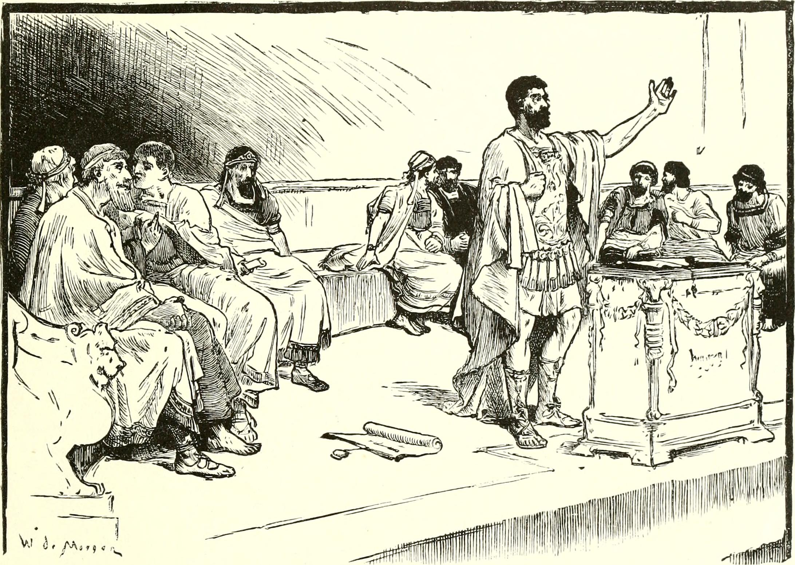

<div align="center">
  
  <p><em>"A Carthaginian general before the Sophetim", W. J. Morgan, from Ridpath's Universal History (1897). Public domain.</em></p>
</div>

# Suffete

> **Suffete**: the Carthaginian high magistrate, the judge of the city. The thing that decides whether what stands before it is sound.

[](https://github.com/carthage-software/suffete/actions/workflows/ci.yml)
[](https://codspeed.io/carthage-software/suffete?utm_source=badge)
[](https://crates.io/crates/suffete)
[](https://github.com/carthage-software/suffete/blob/main/LICENSE-MIT)

Suffete is a standalone PHP type system written in Rust. It provides a representation of PHP types and a type checker. really, a _type comparator_. that answers questions like "is type `A` a subtype of type `B`?", "what is the union of these two types?", and "how do generic parameters resolve here?".

It is **not** a static analyzer, or a typed linter. It is the type-system _core_ that such tools can build on top of.

The driving requirement is **completeness**: every PHP type that PHPStan, Psalm, or Hack can express should be representable here, with the semantics that working PHP analyzers expect.

## Status

> [!WARNING]
> **Suffete is not stable.** There is no estimated date for stability. The public API will break, often without warning, sometimes daily. Internals are in flux. Behavior may be incorrect.
>
> If you are considering using `suffete` in your own project today: don't. Wait until this notice is gone.

## Roadmap

The long-term goal is for `suffete` to replace the type-system core inside [Mago](https://github.com/carthage-software/mago), the Carthage Software PHP toolchain. Until that migration is feasible, `suffete` lives in its own repository so it can be designed, tested, and benchmarked in isolation, without an analyzer attached to it.

## Type System Documentation

The [`type-system/`](./type-system/) directory contains a type-theoretic description of the PHP type universe and the operations defined over it. Four chapters:

- [`types.md`](./type-system/types.md): every atom, every refinement axis, what each type denotes.
- [`comparison.md`](./type-system/comparison.md): the subtyping relation, disjointness, overlap, and admissible coercions.
- [`combination.md`](./type-system/combination.md): union as least upper bound, absorption rules, generalisation thresholds.
- [`intersection.md`](./type-system/intersection.md): intersection, difference, and narrowing under assertions.

These chapters describe the contract any implementation must satisfy. They are likely to evolve in detail as the implementation matures, but the shape of the universe is stable.

## Getting Started

```toml
# Cargo.toml
[dependencies]
suffete = "0.1"
```

(See the warning above before you actually do this.)

## Contributing

Contributions are welcome. Please read [CONTRIBUTING.md](CONTRIBUTING.md) and the [Code of Conduct](CODE_OF_CONDUCT.md) before opening a pull request.

## License

Suffete is dual-licensed under either of:

- Apache License, Version 2.0 ([LICENSE-APACHE](LICENSE-APACHE) or <https://www.apache.org/licenses/LICENSE-2.0>)
- MIT License ([LICENSE-MIT](LICENSE-MIT) or <https://opensource.org/licenses/MIT>)

at your option.
