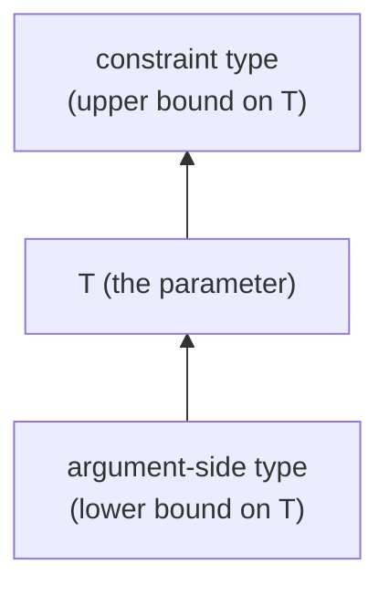
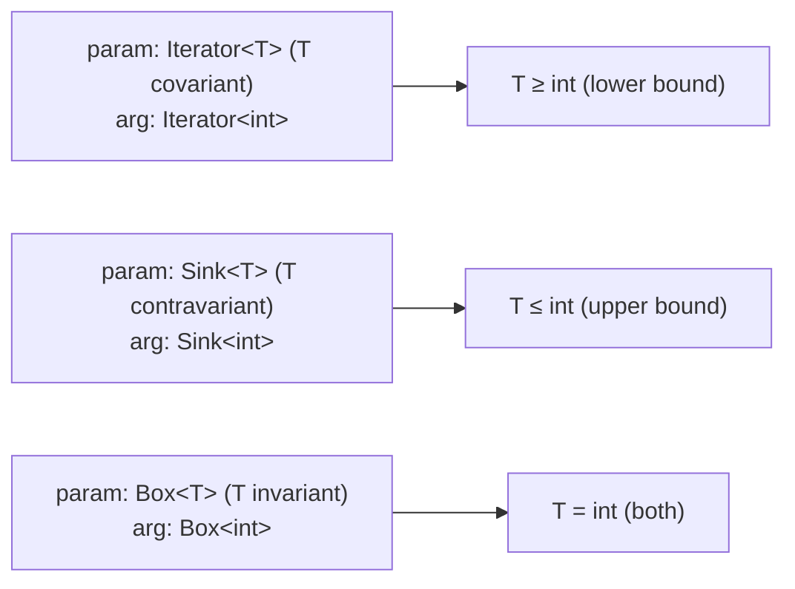

# Inference: standin and infer

When the user calls a generic function or method *without* supplying explicit type arguments — `id($x)` rather than `id<int>($x)` — the analyser must *infer* the type arguments from the call-site arguments. Two primitives do the work:

- **standin** — a single inference round: walk a parameter type against an argument type, and accumulate the bounds the argument imposes on each free template parameter.
- **infer** — apply a fully-determined template environment to a type.

## standin: one round of inference

`standin` is *one round* — one parameter, one argument, one walk. The analyser typically runs `standin` once per call-site argument, against the matching parameter type, before reading the accumulated environment.

### The standin environment

The environment collects two kinds of bound for each template parameter:

- **Lower bounds** ($\sigma \mathrel{<:} T$): types the argument provided that the parameter must accept.
- **Upper bounds** ($T \mathrel{<:} \sigma$): types the parameter must produce that the argument is forced to expose.

The "upper" / "lower" terminology comes from the lattice direction:



A simple call `id<T>` invoked with `id(7)` accumulates a lower bound `int <: T` (the argument forces `T` to be at least `int`).

### How standin walks

Like substitution, `standin` is a structural recursion. It walks the parameter type and the argument type *together*, in lockstep, and at each leaf — every template-parameter Element on the parameter side — it records a bound.

The recursion respects the same nesting substitution does: object type-args, list element types, callable signatures, intersections, conditionals, and so on.

When the parameter and argument structures don't align (a parameter expecting `array<K, V>` matched against an argument of type `int`), the walker silently fails to record bounds — there is no way to derive a bound from a structural mismatch. The analyser sees an empty (or partial) environment and reports a type error in its own layer.

## infer: applying a determined environment

After all standin rounds complete, the analyser has an environment containing every bound. To produce the inferred type arguments, it:

1. For each parameter `T` with one or more lower bounds, joins them: `T := lo_1 ⊔ lo_2 ⊔ … ⊔ lo_n`.
2. Verifies the inferred `T` against any upper bounds: each `T <: hi_i` must hold.
3. Verifies the inferred `T` against the parameter's declared upper bound (the constraint).
4. Substitutes the inferred values back into the function's return type.

`infer` is the convenience that walks a type and substitutes every template-parameter Element using the joined lower bounds in the environment. Parameters with no lower bound are filled with their declared upper bound (or `mixed`).

## Worked example: identity function

```php
/**
 * @template T
 * @param T $x
 * @return T
 */
function id($x) { return $x; }

id(7);          // T inferred to int(7) (or generalised to int).
id("hello");    // T inferred to literal "hello" (or generalised to string).
id($foo);       // where $foo: Foo. T inferred to Foo.
```

For `id(7)`:

1. The parameter type is `T`; the argument type is `int(7)`.
2. `standin` walks them together; the parameter side is the `T` Element, so the environment records `T → lower bound = int(7)`.
3. `infer` substitutes the function's return type (`T`) with the joined lower bound, producing `int(7)`.

## Worked example: collection

```php
/**
 * @template T
 * @param array<T> $xs
 * @return T
 */
function head(array $xs) { /* ... */ }

head([1, 2, 3]);                  // T → int<1,3>
head(['a', 'b']);                 // T → 'a'|'b' (or generalised to string)
head([new Foo(), new Bar()]);     // T → Foo|Bar
```

For `head([1, 2, 3])`:

1. The parameter type is `array<T>`; the argument type is `array<int, int<1,3>>` (the literal array's inferred type).
2. `standin` recurses into the array's value parameter: parameter side is `T`, argument side is `int<1, 3>`.
3. The environment records `T → lower bound = int<1, 3>`.
4. `infer` substitutes the return type `T` with `int<1, 3>`.

## Worked example: multiple arguments

```php
/**
 * @template T
 * @param T $a
 * @param T $b
 * @return array{0: T, 1: T}
 */
function pair($a, $b): array { /* ... */ }

pair(1, "hello");  // T → int(1)|"hello" (generalised to int|string)
```

The analyser runs `standin` once per argument:

1. First argument: parameter `T`, argument `int(1)`. Environment: `T → [int(1)]`.
2. Second argument: parameter `T`, argument `"hello"`. Environment: `T → [int(1), "hello"]`.

`infer` joins the lower bounds, producing `int(1) | "hello"`.

## Variance and standin

Variance affects which side of the lattice direction `standin` records the bound on:

- **Covariant** position: argument is a *lower bound* on `T`.
- **Contravariant** position: argument is an *upper bound* on `T`.
- **Invariant** position: argument is *both* a lower and upper bound (must be exact match).



The `standin` walker queries the world for the variance of each parameter when descending into a parameterised type.

## Why two operations

Conceptually, inference is one operation: "given parameter and arguments, return the inferred environment". The split into `standin` (per-argument) and `infer` (final synthesis) lets the analyser:

- Run multiple standin rounds across multiple arguments.
- Inject extra bounds from other sources (e.g. a hand-written `@template T of int` on the call site).
- Verify intermediate states (e.g. abort inference early if a contradiction is found).
- Apply the result to multiple types (the return type, the throws clause, derived types).

## A subtle case: variables in arguments

Suppose the analyser is inferring inside a generic function body:

```php
/**
 * @template T
 * @param T $x
 * @return T
 */
function id($x) { return $x; }

/**
 * @template U
 * @param U $y
 * @return U
 */
function wrap($y) { return id($y); }
```

For `wrap`'s body call `id($y)`:

- The argument is `$y` of type `U` (a template-parameter Element).
- The parameter is `id::T` (a different template-parameter Element).
- `standin` records: `id::T → lower bound = U`.

The lower bound is itself a template-parameter Element (since `U` is still free in `wrap`'s body). The inferred return type for `id($y)` is `U`. When `wrap` is later invoked with a concrete argument, the chain resolves.

> **See also:** [substitute](./substitute.md) for the substitution operation `infer` uses internally; [specialise](./specialise.md) for inheritance-binding resolution; [variance](./variance.md) for how variance is consulted during walking.
