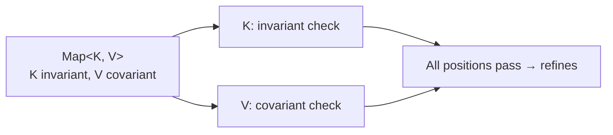

# Variance

The variance of a template parameter governs whether a subtype substitution at the parameter position produces a subtype of the parameterised type.

| Variance | Rule | Source syntax |
|---|---|---|
| **Covariant** | $\sigma \mathrel{<:} \sigma'$ implies $\mathrm{C}\langle\sigma\rangle \mathrel{<:} \mathrm{C}\langle\sigma'\rangle$ | `@template-covariant T` |
| **Contravariant** | $\sigma \mathrel{<:} \sigma'$ implies $\mathrm{C}\langle\sigma'\rangle \mathrel{<:} \mathrm{C}\langle\sigma\rangle$ | `@template-contravariant T` |
| **Invariant** | only $\sigma \equiv \sigma'$ produces $\mathrm{C}\langle\sigma\rangle \equiv \mathrm{C}\langle\sigma'\rangle$ | `@template T` (default) |

## Why variance matters

PHP's type system without variance is rigid: `Box<int> $\mathrel{<:}$ Box<mixed>` only when the analyser hand-codes the rule. With variance declarations, the lattice answers correctly and uniformly:

- **Read-only containers** (e.g. `Iterator<T>`) are naturally covariant: an `Iterator<int>` *is* an `Iterator<mixed>` (you can read ints out of it as mixeds). PHP-side: `@template-covariant T`.
- **Write-only containers** (e.g. a `Sink<T>` accepting `T` values) are naturally contravariant: a `Sink<mixed>` accepts an int (because it accepts everything). So `Sink<mixed> $\mathrel{<:}$ Sink<int>`. PHP-side: `@template-contravariant T`.
- **Read-and-write containers** (e.g. `Box<T>` with both `get(): T` and `set(T): void`) are invariant: changing `T` would break either the getter or the setter. PHP-side: `@template T` (default).

## How the lattice uses variance

When the lattice decides $\mathrm{C}\langle a_1, \dots, a_n\rangle \mathrel{<:} \mathrm{C}\langle b_1, \dots, b_n\rangle$ (same class on both sides), it asks the world for each parameter's variance, and compares positionally:

- **Covariant**: $a_i \mathrel{<:} b_i$.
- **Contravariant**: $b_i \mathrel{<:} a_i$.
- **Invariant**: $a_i \mathrel{<:} b_i$ AND $b_i \mathrel{<:} a_i$.

If every position passes, the whole refines query passes.

## Variance for inherited classes

When the input is a *descendant* of the container's class, the lattice asks the world to resolve what the descendant supplies to each ancestor parameter. The variance check then runs on the resolved arguments.

For example, with `class StringList extends ArrayList<string>` and `class ArrayList<T> implements Iterator<T>`:

```
StringList <: Iterator<string>
  ↓
StringList → ArrayList<string>     (StringList extends ArrayList<string>)
  ↓
ArrayList<string> → Iterator<string>  (ArrayList implements Iterator<T>, T := string)
  ↓
Iterator<string> <: Iterator<string>  ✓ (covariant or invariant, both pass)
```

The lattice's [object family](../lattice/refines.md) handles this chain.

## Variance and substitution

Variance does not affect substitution itself ; substitution always replaces every template-parameter Element matching the substitution key, regardless of variance. Variance affects the *use site*: when the analyser asks "is this instance a subtype of that?", the variance is consulted to decide which direction of refines to check.

## Default-filled type-args and variance

When a class declares a parameter and the user supplies fewer arguments than declared, the missing args are filled with their declared upper bounds (or `mixed` if undeclared). The resulting type is flagged as carrying a template default.

The variance check at refinement time consults the flag:

- A default-filled type-arg flowing into a *covariant* or *invariant* position is allowed without strict refinement; the lattice records the coercion cause so the analyser can warn.
- A default-filled type-arg flowing into a *contravariant* position is checked normally.

This rule prevents `Box` (the parameter-less reference) from being non-refining in `Box<int>` callsites, while still letting the analyser surface the use of an unpinned parameter in its diagnostics.

## A worked example

```php
/**
 * @template-covariant T
 */
interface Iterator {
    /** @return T */
    public function current(): mixed;
}

/**
 * @implements Iterator<int>
 */
class IntIterator implements Iterator { /* ... */ }

function f(Iterator $it): void { /* ... */ }

f(new IntIterator());
```

Checking `IntIterator` refines `Iterator<numeric>`:

1. `IntIterator` is not the same class as `Iterator`, so the lattice walks the inheritance.
2. `IntIterator implements Iterator<int>` ; the world resolves position 0 of `Iterator` from `IntIterator` to `int`.
3. The container's `Iterator` declares position 0 as covariant.
4. Covariant: check `int $\mathrel{<:}$ numeric`. ✓ (`int` is in the `numeric` true-union).
5. Result: `IntIterator` refines `Iterator<numeric>`. ✓

If `Iterator`'s `T` were invariant, the answer would be different: `int $\equiv$ numeric` is false (numeric admits `float` and `numeric-string`, int does not), so the call would fail.

## Bivariant / unsafe-covariant

PHP-side, neither is supported. Suffete does not have a fourth variance kind; the standard three are sufficient for what real-world PHP analysers express.

## Multiple parameters

When a class has multiple parameters, each has its own variance. `Map<K, V>` typically declares `K` as invariant (because keys are used both to read and write) and `V` as covariant (because the user typically reads values out). The variance check runs per-position with the per-position variance.



> **See also:** [refines](../lattice/refines.md) for the object-family rules that consult variance; [specialise](./specialise.md) for inheritance-binding resolution.
