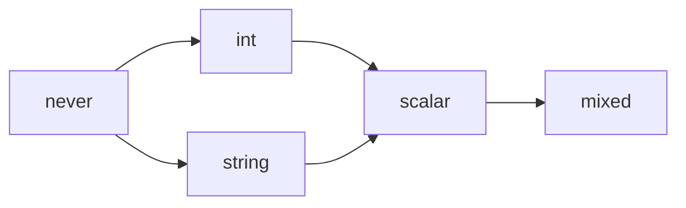

# Introduction

Suffete is a standalone PHP type system, written in Rust, designed to be the type-system core of a static analyzer.

It is not an analyzer. It does not parse PHP, walk control flow, infer types from expressions, or report diagnostics. It is the layer underneath all of those: a representation of every PHP type a real-world analyzer needs to express, plus the operations that move types around the lattice — subtype check, union, intersection, set difference, narrowing under assertions, generic substitution, generic inference.

If you are building an analyzer, suffete answers the questions you would otherwise have to answer yourself, and it answers them with a stable contract: same inputs, same answers, no spooky action across the codebase.

## What this book covers

The book is organised in eight parts. Each part stands on its own; you don't need to read them in order, but the earlier parts assume less.

- **[Part I — Foundations](./foundations/what-is-suffete.md)** — what suffete is, why it exists as a separate crate, a quick guided tour, and the notation we use throughout.
- **[Part II — The Type Universe](./universe/elements.md)** — every PHP type expressible in suffete: scalars, special elements, objects, arrays, lists, iterables, callables, resources, class-like strings, refinement axes, the `Negated` and `Intersected` wrappers, unresolved elements, and templates.
- **[Part III — The Lattice](./lattice/refines.md)** — the operations that relate and combine types: `refines`, `overlaps`, `meet`, `join`, `subtract`, `narrow`. Plus the algebraic laws every operation is required to satisfy.
- **[Part IV — Generics](./generics/templates.md)** — template parameters, variance, capture-free substitution, the `standin` inference round, and the inheritance specialisation that resolves what a class supplies to a parameter of one of its ancestors.
- **[Part V — Public API](./api/handles.md)** — the Rust crate surface: `TypeId`, `ElementId`, `TypeBuilder`, predicates, inspection, transformation, the `World` trait, casting, expansion, serialization.
- **[Part VI — Cookbook](./cookbook/subtype-question.md)** — recipes that compose the API into the operations a real analyzer needs.
- **[Part VII — Internals](./internals/interner.md)** — optional reading, for when you want to know how the sausage is made: interning, the bit layout of a handle, the SIMD scans, the performance philosophy.
- **[Part VIII — Reference](./reference/element-kinds.md)** — terse, scannable reference material: every element kind, every lattice option, every prelude constant.

## Who this book is for

You know PHP. You know Rust. You know what a static analyzer is and why one would want a type system to lean on. You may not know much programming-language theory, but you know what a tree is, what a set is, what a partial order is.

The book does not try to teach PL theory from scratch. Where we use a term like "lattice", "subtype", "variance", or "least upper bound", we define it the first time it shows up and assume it after that.

## A note on naming

The PL-theory term for the indivisible pieces a type is built from is **atom**. Suffete code calls them **Elements**. This book uses **Element** throughout to match the code, but you will occasionally see "atom" in references to the underlying theory. Treat the words as interchangeable.

The crate also exposes a separately-named type called `mago_atom::Atom` (re-exported as the `atom!` macro). That is unrelated — it is an interned string handle (a name pool), not a type-system element.

## A note on stability

Suffete is pre-1.0 and the API is unstable. The book documents the API as it stands at the latest commit on `main`. If you are pinning to a published version, prefer `cargo doc --open` for the version-correct API; this book is the conceptual reference, not a frozen release artifact.

## How to read examples

PHP source is shown as:

```php
function f(int|string $x): bool { /* ... */ }
```

Rust against the suffete crate is shown as:

```rust,ignore
use suffete::{TypeBuilder, TypeId, prelude::{INT, STRING}};

let union: TypeId = TypeBuilder::new()
    .push(INT)
    .push(STRING)
    .build();
```

Mathematical notation uses MathJax. The subtype relation is $\tau \mathrel{<:} \sigma$ ; least upper bound is $\tau \sqcup \sigma$ ; greatest lower bound is $\tau \sqcap \sigma$ ; set difference is $\tau \setminus \sigma$ ; bottom is $\bot$ ; top is $\top$. The full notation table is in the [glossary](./foundations/glossary.md).

Diagrams use mermaid:



## When you find something wrong

If a definition contradicts the code, the code wins and the book is buggy. Please open an issue or a PR; the book lives in [`book/`](https://github.com/carthage-software/suffete/tree/main/book) of the suffete repository and accepts the same kind of contributions as the code.
