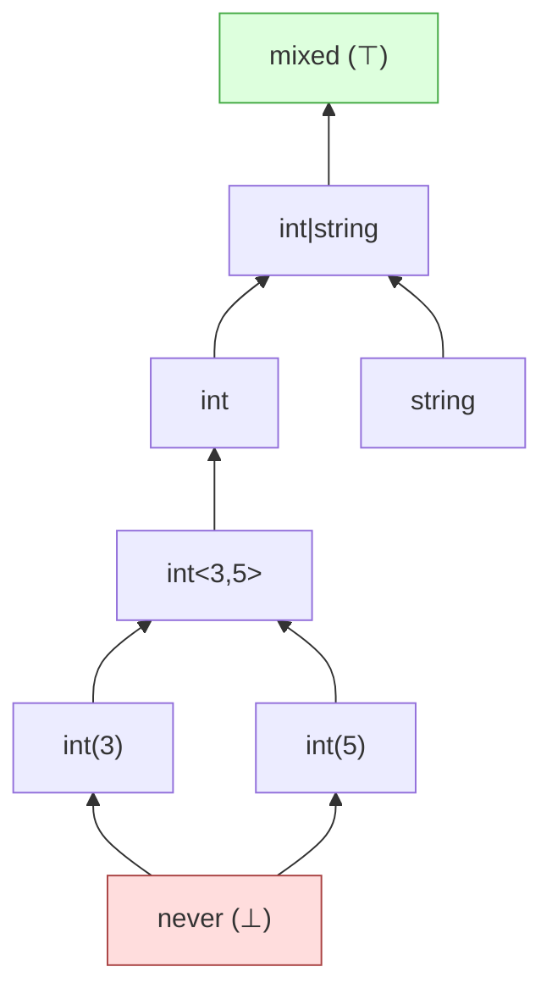

# Least upper bound: join

The join $\tau \sqcup \sigma$ is the smallest type that both $\tau$ and $\sigma$ refine. PHP-side: the union, with absorption and merging applied.

## What "least upper bound" means

Among all types $\rho$ such that $\tau \mathrel{<:} \rho$ and $\sigma \mathrel{<:} \rho$:

- $\rho = \mathit{mixed}$ always works.
- The lattice's job is to find the *smallest* such $\rho$.

Operationally: join is the type whose value-set is the *union* of $\tau$'s and $\sigma$'s value-sets, expressed as concretely as the kind system allows after canonicalisation.

Examples:

| $\tau$ | $\sigma$ | $\tau \sqcup \sigma$ |
|---|---|---|
| `int` | `string` | `int\|string` |
| `int(0)` | `int(1)` | `int<0,1>` |
| `int<0,10>` | `int<5,15>` | `int<0,15>` |
| `true` | `false` | `bool` |
| `int(0) \| int(1) \| ... \| int(9)` | -- | `int<0,9>` (range collapse threshold) |
| `Foo` | `Bar` | `Foo\|Bar` (no canonical class union) |
| `int` | `int\|string` | `int\|string` (subsumption) |
| `never` | `int` | `int` |
| `mixed` | `int` | `mixed` |

## How join is computed

Conceptually: gather every Element from both sides, then canonicalise.

The canonicalisation rules apply in order:

1. **Top wins**: if `mixed` is in the union, the result is `mixed` and everything else is dropped.
2. **Bottom is absorbed**: if `never` is in the union, drop it (unless it's the only thing).
3. **Void canonicalises to null in non-degenerate unions**: in any union of length > 1, `void` is replaced by `null` (and not duplicated if `null` is already present). PHP runtime: a `void` function returns the value `null` to its caller, so at every value-flow site `void` is observationally `null`. `void` alone is preserved so a `: void` return-type annotation round-trips. Examples: `void | int` collapses to `int | null` ; `void | null` collapses to `null` ; `void | never` collapses to `void` (the `never` is dropped first).
4. **Bool composition**: `true | false = bool`. `bool | true = bool`. `bool | false = bool`.
5. **Resource composition**: `open-resource | closed-resource = resource` (when no specific kind).
6. **Same-kind dominator**: same-kind Elements may collapse to a single range or merged unspecified form.
7. **Range merging**: adjacent or overlapping integer ranges merge.
8. **Literal collapse**: many literals of the same kind collapse to a range or unspecified Element when they exceed a threshold.
9. **Family-level absorption**: `int | int<0,10> = int`. `string | non-empty-string = string`. Subsumption applied symmetrically.
10. **Subtype absorption**: any Element subsumed by a structurally larger Element in the same multiset is dropped (`Foo | Bar` where `Bar extends Foo` collapses to `Foo` ; the rule consults the world).

## Range merging

Joining adjacent or overlapping integer ranges merges them:

| $\tau$ | $\sigma$ | $\tau \sqcup \sigma$ |
|---|---|---|
| `int<0,5>` | `int<3,10>` | `int<0,10>` (overlap) |
| `int<0,5>` | `int<6,10>` | `int<0,10>` (adjacent) |
| `int<0,5>` | `int<10,15>` | `int<0,5> \| int<10,15>` (gap) |
| `int(7)` | `int<8,10>` | `int<7,10>` |
| `int<0,∞>` | `int<-∞,5>` | `int` (unspecified) |

The rule applies symmetrically: literals join with ranges that contain or are adjacent to them; ranges that span the entire integer line collapse to `int`.

## Literal collapse

A union of many literals of the same kind collapses. The thresholds are conservative: a small number of literals stays as a union (so the analyser can constant-fold), but a *large* union widens.

- Int literals: ten literals of the same range form a range; many literals form unspecified `int`.
- Float literals: similar, with a higher threshold (floats have less natural "tight" structure).
- String literals: more than a small number of literals collapses to unspecified `string` with the join of their axes (e.g. all literals satisfy `lowercase` → result is `lowercase-string`).

The defaults err on the side of widening eagerly; that prevents the analyser from carrying around 1000-element unions that no human will ever look at.

## Subtype absorption

If two Elements are in the union and one refines the other, the more specific one is dropped:

```
int | int<0,10>                    → int
Foo | Bar                          → Foo  (when Bar extends Foo)
literal "hello" | non-empty-string → non-empty-string
```

The absorption is *not* applied for coercion-driven refinements. `int $\mathrel{<:}$ float` via PHP runtime coercion does *not* drive absorption: `int|float` stays distinct so the analyser knows the value was originally typed as `int`.

## Object union

Joining two named objects with no subtype relationship gives back the union:

```
Foo | Bar → Foo|Bar  (when neither extends the other)
```

If one extends the other, subtype absorption fires:

```
Foo | Bar → Foo  (when Bar extends Foo)
```

If both extend a common ancestor, the lattice does *not* automatically widen to the ancestor. Given `class A {} class B extends A {} class C extends A {}`, `B | C → B|C`, not `A`. This is conservative but correct: widening to the ancestor would lose the information that the value cannot be `class D extends A`.

The analyser can request widening explicitly via the inspection layer, which does walk up the hierarchy.

## Sealed shape join

Joining two sealed shapes:

```
array{a: int} ⊔ array{b: string} → array{a?: int, b?: string}
```

Each key on the left becomes optional in the result (it might not be present on the right side); each key on the right becomes optional in the result (similarly). Common keys with different value types use the per-value join.

A sealed shape joined with a generic array decomposes the shape and joins:

```
array{a: int} ⊔ array<string, bool> → array<string|'a', int|bool>
```

## A worked example

`int | string` joined with `int` is `int | string` ; the right side refines the `int` Element on the left, which absorbs it.

`int<0, 5>` joined with `int<3, 10>` is `int<0, 10>` ; the ranges overlap and merge.

`true` joined with `false` is `bool` ; the bool-composition rule fires.

## Visualising the lattice



Join moves *up* this lattice; the join of two types is the lowest node that sits above both.

## Properties

The [laws](./laws.md) chapter checks:

- **Idempotence**: $\tau \sqcup \tau \equiv \tau$.
- **Commutativity**: $\tau \sqcup \sigma \equiv \sigma \sqcup \tau$.
- **Associativity**: $(\tau \sqcup \sigma) \sqcup \rho \equiv \tau \sqcup (\sigma \sqcup \rho)$.
- **Identity**: $\tau \sqcup \bot \equiv \tau$.
- **Annihilator**: $\tau \sqcup \top \equiv \top$.
- **LUB property**: For all $\rho$, $\tau \mathrel{<:} \rho$ and $\sigma \mathrel{<:} \rho$ implies $(\tau \sqcup \sigma) \mathrel{<:} \rho$.
- **Absorption**: $\tau \sqcap (\tau \sqcup \sigma) \equiv \tau$ and $\tau \sqcup (\tau \sqcap \sigma) \equiv \tau$.

The LUB property is the soundness interlock with refines: join must produce an *upper bound*, and any other upper bound must contain it.

> **See also:** [meet](./meet.md) for the dual; [refines](./refines.md) for the per-Element subtyping that drives subsumption; [laws](./laws.md) for the algebraic checks.
