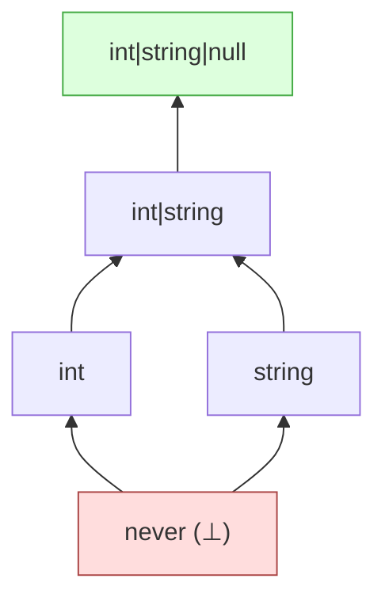

# Greatest lower bound: meet

The meet $\tau \sqcap \sigma$ is the largest type that refines both $\tau$ and $\sigma$. PHP-side: the type-level intersection.

## What "greatest lower bound" means

Among all types $\rho$ such that $\rho \mathrel{<:} \tau$ and $\rho \mathrel{<:} \sigma$:

- $\rho = \mathit{never}$ always works (vacuously).
- The lattice's job is to find the *largest* such $\rho$.

Operationally: meet is the type whose value-set is the *intersection* of $\tau$'s and $\sigma$'s value-sets, expressed as concretely as the kind system allows.

Examples:

| $\tau$ | $\sigma$ | $\tau \sqcap \sigma$ |
|---|---|---|
| `int` | `string` | `never` |
| `int\|string` | `int\|null` | `int` |
| `int<0,10>` | `int<5,15>` | `int<5,10>` |
| `mixed` | `int` | `int` |
| `Foo` | `Bar` (sibling classes) | `Foo & Bar` |
| `Foo` | `!Foo` | `never` |
| `non-null mixed` | `int\|null` | `int` |
| `array<int, mixed>` | `array<int, string>` | `array<int, string>` |

## Type-level rule

For every Element pair $(e_1, e_2)$ where $e_1 \in \tau$ and $e_2 \in \sigma$, compute the per-pair meet, and union the results. If every pair is disjoint, the result is `never`.

$$\tau \sqcap \sigma \;=\; \bigsqcup_{e_1 \in \tau,\; e_2 \in \sigma} (e_1 \sqcap e_2)$$

## Element-level dispatch

For Elements $a, b$, the per-pair meet fires its tests in this order:

1. **Uninhabited check** — if either is uninhabited, the meet is `never`.
2. **Reflexivity** — $a \sqcap a = a$.
3. **`never` axiom** — $\bot \sqcap a = \bot$.
4. **Top** — $\top \sqcap a = a$.
5. **Placeholder** — placeholder $\sqcap a = a$ by inference convention.
6. **PHP runtime separation** — `int` and `float` are runtime-coercible but not subset-related; treat them as disjoint at the value level.
7. **Wrappers** — Negated and Intersected dispatch (below).
8. **Narrowed mixed** — axis-AND rules (below).
9. **Subsumption** — if one refines the other, return the smaller.
10. **Generic-parameter projection** — meet via constraint.
11. **Family-specific intersection rules** — last resort.

## The wrapper rules

### Meet involving negation

The standard set-theoretic identity:

$$a \sqcap \neg b \;=\; a \setminus b$$

This routes to [subtract](./subtract.md). For `int $\sqcap$ !int(0)`, the result is `int<-∞, -1> | int<1, ∞>`.

The dual case ($\neg a \sqcap b = b \setminus a$) is handled symmetrically.

The case $\neg a \sqcap \neg b$ uses De Morgan: $\neg(a \sqcup b)$. The result is a single negation wrapping the join.

### Meet involving intersection

Intersection with anything adds a new conjunct: $(H \sqcap C_1 \sqcap \dots \sqcap C_n) \sqcap X = H \sqcap C_1 \sqcap \dots \sqcap C_n \sqcap X$. The universe canonicalises by sorting and deduplicating conjuncts.

Intersection meet intersection flattens both conjunct lists and re-intersects.

If the new conjunct is incompatible with the head or another conjunct, the meet collapses to `never`.

## The narrowed-mixed meet

Meet of two narrowed `mixed` Elements ANDs their axes: `non-null mixed $\sqcap$ truthy mixed = non-null truthy mixed`. If the axes are inconsistent (e.g. `truthy mixed $\sqcap$ falsy mixed`), the result is `never`.

Meet of a `mixed`-with-axes and a non-`mixed` Element: the non-`mixed` Element is returned, but only if it satisfies the axes ; otherwise `never`. `non-null mixed $\sqcap$ int = int`. `non-null mixed $\sqcap$ null = never`.

Some narrowings decompose into multiple Elements. `truthy mixed $\sqcap$ int` produces `int<-∞, -1> | int<1, ∞>` (the `0` is excluded). The result is still a single type, just with two Elements.

## Family-specific intersection rules

Each family has its own intersection logic:

- **Int / Int**: range intersection. `int<0,10> $\sqcap$ int<5,15> = int<5,10>`. Empty intersection → `never`.
- **Float / Float**: literal-vs-literal equality, otherwise `never`.
- **String / String**: literal-vs-literal equality; unspecified-with-axes $\sqcap$ literal returns the literal if it satisfies the axes; axis-AND otherwise.
- **String / class-like-string**: literal `"Foo"` $\sqcap$ `class-string<Foo>` returns the literal if it names the class; otherwise `never`.
- **Object / Object**: same class → per-position parameter meet; different classes → an `Foo & Bar` intersection.
- **Object / enum**: `never` (objects and enums are disjoint).
- **Object / object shape**: an `object & object{...}` intersection, unless the world says the class doesn't have the shape's properties.
- **Object / has-method, has-property**: similarly an intersection.
- **Array / Array**: sealed-vs-sealed key-by-key; sealed-vs-generic; generic-vs-generic per-parameter.
- **List / List**: same idea, by index.
- **Iterable / Array, List**: per-parameter, then return the more specific kind.
- **Callable / Callable**: signature meet (return type meet, parameter type joins for contravariance, throws meet).

## Sealed shape meet

A specifically tricky case. Meet of two sealed shapes:

```
array{a: int, b?: string} ∩ array{a: int<0,100>, c: bool}
```

The result is a sealed shape with the union of keys, each value being the meet of the per-key types:

- `a`: `int $\sqcap$ int<0,100> = int<0,100>` ; required (both required).
- `b`: only on the left, optional on the left, *missing* on the right. A required key on the right would force absence on the left ; here `b` is optional on the left, so the result has `b?: string` (still optional).
- `c`: only on the right, required. This is a problem — the right *requires* `c` but the left does not have `c`. The result is `never` because no value satisfies both.

The full sealed-shape-meet logic checks each key against the other side's known items and the sealed bit, and returns `never` if the result would be uninhabited.

## A worked example

```php
/**
 * @param int<0, 10> $x
 * @param int<5, 15> $y
 */
```

The meet of these two parameter types is `int<5, 10>`.

```php
/**
 * @param int|string|null $a
 * @param int|null $b
 */
```

The meet is `int|null` ; the `string` Element on the left has no overlap with the right.

## Visualising the result lattice



Meet moves *down* this lattice; the meet of two types is the highest node that sits below both.

## Properties

The [laws](./laws.md) chapter checks all of these on every CI run:

- **Idempotence**: $\tau \sqcap \tau \equiv \tau$.
- **Commutativity**: $\tau \sqcap \sigma \equiv \sigma \sqcap \tau$.
- **Associativity**: $(\tau \sqcap \sigma) \sqcap \rho \equiv \tau \sqcap (\sigma \sqcap \rho)$.
- **Identity**: $\tau \sqcap \top \equiv \tau$.
- **Annihilator**: $\tau \sqcap \bot \equiv \bot$.
- **GLB property**: For all $\rho$, $\rho \mathrel{<:} \tau$ and $\rho \mathrel{<:} \sigma$ implies $\rho \mathrel{<:} (\tau \sqcap \sigma)$.

The GLB property is the soundness interlock with refines: meet must produce a *lower bound*, and any other lower bound must refine it.

> **See also:** [refines](./refines.md) for the per-Element subtyping; [join](./join.md) for the dual operation; [narrow](./narrow.md) for the assertion-aware variant; [subtract](./subtract.md) for the difference operation that meet uses internally for negations; [laws](./laws.md) for the algebraic checks.
