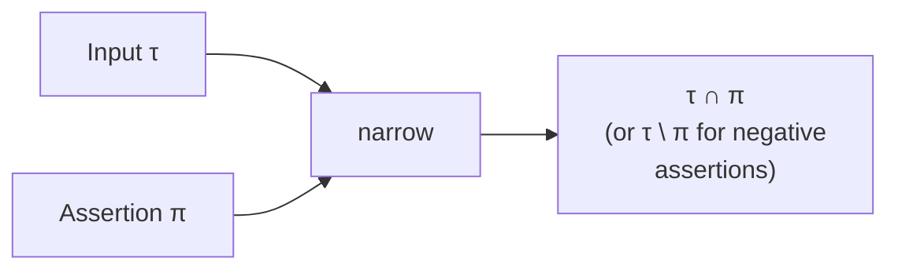

# Narrowing under assertions

The narrow operation $\mathit{narrow}(\tau, \pi)$ refines a type $\tau$ by an *assertion* $\pi$. PHP-side: the type after a control-flow assertion fires — the type of `$x` after `if ($x instanceof Foo)`, after `if (is_int($x))`, after `if ($x !== null)`, and so on.

## What "narrow" means

The analyser observes some assertion that holds about a value of type $\tau$. It encodes the assertion as a *type* $\pi$ — the set of values that satisfy the assertion. Narrow returns the type whose values are exactly the values of $\tau$ that satisfy $\pi$.

For most assertions, narrow is just meet ($\tau \sqcap \pi$). The cases where narrow does extra work:

- **Negative assertions** that can be expressed as a positive assertion are recognised and routed to subtract instead of meet ($\tau$ is `int|string` and the assertion is "not int" → subtract `int` from $\tau$).
- **Mixed-axis assertions** (truthiness, non-null, non-empty) propagate the axis even when the input is not `mixed`, narrowing kinds on the way (`mixed` after `truthy` becomes `truthy mixed` ; `int|null` after `non-null` becomes `int`).
- **Unsound input cases** are detected and the lattice avoids producing nonsense (narrowing `Foo` by `int` is `never`, not `Foo & int`).

## Operation summary

The relationship to the other operations:

| Assertion shape | Operation |
|---|---|
| Positive: "value satisfies $\pi$" | $\tau \sqcap \pi$ (meet) |
| Negative: "value does not satisfy $\pi$" | $\tau \setminus \pi$ (subtract) |
| Mixed-axis (truthy, non-null, etc.) | meet with axis-propagation rules |
| Class assertion (`instanceof Foo`) | meet, with class-hierarchy rules |
| Equality assertion (`$x === 5`) | meet with the singleton type |

In the analyser layer, the assertion-extraction code chooses the right form. `narrow` is the operation that runs after the choice is made.

## Worked examples

### Nullable narrowing

```php
function f(?int $x): int {
    if ($x !== null) {
        return $x;  // here $x has type int (not int|null)
    }
    return 0;
}
```

The assertion is `non-null mixed`. Meet of `int|null` with `non-null mixed` — `int` satisfies non-null (kept), `null` does not (dropped). Result: `int`.

### Boolean narrowing

```php
function f(bool $x): true {
    if ($x === true) {
        return $x;  // $x has type true
    }
    throw new RuntimeException();
}
```

The assertion is `true`. Meet of `bool` with `true` is `true` (the literal-true Element).

### Class narrowing

```php
function f(object $x): Foo {
    if ($x instanceof Foo) {
        return $x;  // narrows to Foo
    }
    throw new RuntimeException();
}
```

The assertion is `Foo`. Meet of `object` (the unconstrained object) with `Foo` is `Foo`.

### Class anti-narrowing

```php
function f(Foo|Bar $x): Bar {
    if (!($x instanceof Foo)) {
        return $x;  // subtracts Foo, leaves Bar
    }
    throw new RuntimeException();
}
```

The negative assertion subtracts `Foo` from `Foo|Bar`, leaving `Bar`.

### Truthiness narrowing

```php
/**
 * @return non-empty-string
 */
function f(int|string $x): string {
    if (is_string($x) && strlen($x) > 0) {
        return $x;
    }
    throw new RuntimeException();
}
```

Two narrowings: first `is_string` narrows to `string`; then `strlen > 0` narrows to `non-empty-string`.

The `is_string` assertion is the type `string`; meet of `int|string` with `string` is `string`. The `strlen > 0` assertion translates to a mixed-axis assertion that the value is `non-empty-string`; meet with `string` produces `non-empty-string`.

## Negative assertion handling

The lattice recognises a few negative-assertion patterns and routes them to subtract:

- $\mathit{narrow}(\tau, \neg \sigma)$ → $\tau \setminus \sigma$.
- $\mathit{narrow}(\tau, \sigma)$ where $\sigma$ is `non-null mixed` → meet with the axis (no different from positive narrowing).
- $\mathit{narrow}(\tau, \sigma)$ where $\sigma$ is the empty type → `never` (a no-overlap assertion narrows to bottom).

The analyser layer typically constructs the assertion type with the negation already in place, and `narrow` does the right thing.

## Mixed-axis propagation

When the assertion is a narrowed `mixed`, the lattice propagates the axes through the input's kinds:

- **non-null** axis: drop any input Element that is `null` or `void`. Keep everything else.
- **truthy** axis: keep input Elements that structurally guarantee truthy (objects, resources, non-zero literals, non-empty truthy strings, non-empty arrays/lists). For ambiguous Elements (general `int`, general `string`), narrow them: `int` → `int<-∞,-1> | int<1,∞>`, `string` → `non-empty truthy string`.
- **falsy** axis: keep `null`, `void`, `false`, `int(0)`, `float(0.0)`, `""`, `"0"`, empty arrays/lists. For ambiguous Elements, drop or narrow.
- **empty**: same as **falsy**.
- **isset-from-loop**: only propagates between `mixed` Elements; non-`mixed` inputs lose this axis.

## Decomposition of narrowed mixed

A mixed-axis narrowing may produce multiple Elements:

- `int $\sqcap$ truthy mixed` → `int<-∞,-1> | int<1,∞>` (the `0` is excluded).
- `string $\sqcap$ falsy mixed` → `"" | "0"` (only the falsy strings remain).

The result is still one type, just with multiple Elements.

## A worked example: chained narrowings

```php
function classify(mixed $x): string {
    if (is_int($x)) { return "int"; }
    if (is_string($x) && $x !== "") { return "non-empty string"; }
    if (is_array($x) && count($x) > 0) { return "non-empty array"; }
    return "other";
}
```

The analyser narrows `$x` differently in each branch:

1. After `is_int`: `int`.
2. After `is_string && != ""`: `non-empty-string`.
3. After `is_array && count > 0`: `non-empty-array<array-key, mixed>`.
4. The "else" branch sees the *negation* of each prior assertion: `mixed \ int \ non-empty-string \ non-empty-array<array-key, mixed>`.

Each narrowing is a `narrow` call in the analyser; the result feeds the next.

## Visualising narrow



## Properties

The [laws](./laws.md) chapter checks:

- **Bound**: $\mathit{narrow}(\tau, \pi) \mathrel{<:} \tau$.
- **Reflexivity**: $\mathit{narrow}(\tau, \tau) \equiv \tau$.
- **Annihilator**: $\mathit{narrow}(\tau, \bot) \equiv \bot$.
- **Identity (top assertion)**: $\mathit{narrow}(\tau, \top) \equiv \tau$.
- **Idempotence**: $\mathit{narrow}(\mathit{narrow}(\tau, \pi), \pi) \equiv \mathit{narrow}(\tau, \pi)$.
- **Soundness vs meet**: $\mathit{narrow}(\tau, \pi) \mathrel{<:} (\tau \sqcap \pi)$ when $\pi$ is the positive form ; the narrow result is at most as large as the meet result, sometimes smaller because the axis-propagation rules tighten further.

> **See also:** [meet](./meet.md) for the operation narrow specialises; [subtract](./subtract.md) for the negative-assertion path; [refines](./refines.md) and [overlaps](./overlaps.md) for the underlying relations; [laws](./laws.md) for the soundness checks.
