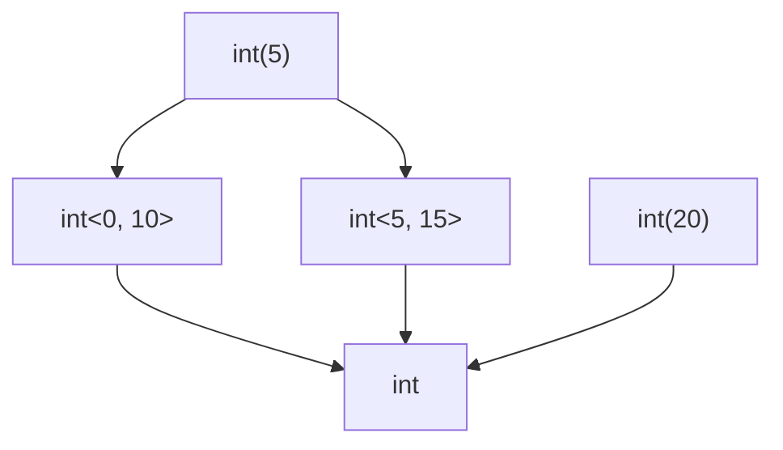

# Overlap and disjointness

The overlap relation $\tau \mathrel{\\#} \sigma$ asks the symmetric question: *do $\tau$ and $\sigma$ share at least one value?*. Its negation is **disjointness**.

Overlap holds iff there exists some value $v$ such that $v \in \tau$ and $v \in \sigma$. Disjointness holds iff no such value exists.

Overlap is the test you want when neither side dominates the other. `int<0,10>` and `int<5,15>` overlap on the value 7, but neither is a subtype of the other. Refines does not see this; overlap does.

## Why both refines and overlaps

Refines is one-directional: $\tau \mathrel{<:} \sigma$ tells you if every value of $\tau$ is also in $\sigma$. Overlap is symmetric: $\tau \mathrel{\\#} \sigma$ tells you if any value is in both.

The two are independent:

- $\tau \mathrel{<:} \sigma$ implies $\tau \mathrel{\\#} \sigma$ when $\tau$ is inhabited.
- $\tau \mathrel{\\#} \sigma$ does not imply $\tau \mathrel{<:} \sigma$ or $\sigma \mathrel{<:} \tau$.

In the analyser, refines answers parameter-vs-argument questions; overlap answers questions like "could this `instanceof Foo` ever succeed?" (yes iff the variable's type overlaps with `Foo`).

## The Type-level rule

For Types $\tau, \sigma$:

$$\tau \mathrel{\\#} \sigma \quad\iff\quad \exists e_1 \in \tau, e_2 \in \sigma \;:\; e_1 \mathrel{\\#} e_2$$

Some pair of Elements, one from each side, must overlap. The Element-level rule does the work.

## The Element-level dispatch

The Element-level rule fires its tests in this order:

1. **`never` axiom** — if either side is `never`, the answer is `false`. `never` has no values; the empty set overlaps nothing.
2. **Uninhabited check** — if either side is uninhabited (e.g. `Foo & int`, the empty sealed shape), the answer is `false`.
3. **Reflexivity** — identical inhabited Elements overlap.
4. **Top** — `mixed` overlaps every inhabited Element.
5. **Placeholder** — overlaps everything by inference convention.
6. **Generic-parameter projection** — a free template parameter overlaps $\sigma$ iff its constraint overlaps $\sigma$.
7. **Subsumption shortcut** — if $a \mathrel{<:} b$ or $b \mathrel{<:} a$, they overlap (one inhabits the other).
8. **Family-specific overlap rules** — last resort.

The order matters. The `never` axiom must fire before the reflexivity rule, otherwise `never` would (wrongly) be reported as overlapping itself.

## The `never` axiom

`never` overlaps with *nothing*, including itself.

In set-theoretic terms: `never` is the empty set. The intersection of the empty set with anything is the empty set. So overlap with `never` is `false`, always.

## Subsumption shortcut

If $a \mathrel{<:} b$ and $a$ is inhabited, then $a$ has some value, and that value is in $b$, so $a \mathrel{\\#} b$. The lattice uses this as an early-exit: try `refines(a, b)` and `refines(b, a)`, and if either holds, return `true`.

This makes the common cases (one side dominates the other) fast and avoids re-implementing the case analysis the family rules already do.

## Family-specific positive rules

When neither subsumption nor the universal axioms fire, the lattice consults the family-specific rules. These add precision in cases where neither side dominates:

- **Int ranges**: `int<0,10>` overlaps `int<5,15>` because both contain `5..=10`.
- **String literals and refinements**: `"hello"` overlaps `non-empty-string` (the literal satisfies the axis).
- **Class hierarchies**: `Foo` overlaps `Bar` if the world says they share a descendant, or one is final and structurally satisfies the other.
- **Iterables and arrays**: `iterable<int, int>` overlaps `array<int, int>` ; arrays are iterables.
- **Narrowed mixed**: cross-axis overlap rules.

The family rules are *incomplete by design*: adding a positive rule never weakens correctness (the relation is monotone in true outcomes). Missing rules cost precision but not soundness ; a downstream `narrow` returns `never` instead of a real overlap, and the analyser is conservative rather than wrong.

## Uninhabited Elements

Some Elements have no values:

- `never` itself.
- An intersection whose head and some conjunct are disjoint, or whose head is `never`, or where two conjuncts are disjoint (e.g. `Foo & int`).
- A sealed object shape with no properties.

Note that `array{}` (the empty sealed array) is *not* uninhabited ; it has exactly one inhabitant, the empty array.

## A worked example

Consider three integer ranges:

- $r_1 = \texttt{int<0, 10>}$
- $r_2 = \texttt{int<5, 15>}$
- $r_3 = \texttt{int<20, 30>}$

Then:

- $r_1 \mathrel{\\#} r_2$ ; they share `5..=10`.
- $r_1$ does not overlap $r_3$ ; the ranges are disjoint.

## Visualising overlap vs refines

In this diagram:

- `int<0,10>` overlaps `int<5,15>` ; they share `int(5)..int(10)`. Neither refines the other.
- `int(5)` refines `int<0,10>` ; subsumption. Also they overlap.
- `int<0,10>` does not overlap `int(20)` ; disjoint.

## A subtle case: empty types overlap with nothing

`never` does not overlap itself. There are no values in `never`, so the question "do they share a value?" is vacuously false. This is correct set-theoretically and is what the analyser expects ; an `instanceof` against an uninhabited type is unreachable, not always-true.

## When overlaps and refines disagree

By construction, when both terms are inhabited:

- $\tau \mathrel{<:} \sigma$ implies $\tau \mathrel{\\#} \sigma$.
- $\sigma \mathrel{<:} \tau$ implies $\tau \mathrel{\\#} \sigma$.

But:

- $\tau \mathrel{\\#} \sigma$ does *not* imply either direction of refines.

If you find a case where refines holds and overlaps does not (with an inhabited subtype), that is a soundness violation. The [laws](./laws.md) chapter has the algebraic identity that catches this in CI.

> **See also:** [refines](./refines.md) for the asymmetric subtype relation; [meet](./meet.md) for the operation that produces a type representing the overlap; [laws](./laws.md) for the soundness interlock between refines and overlap.
