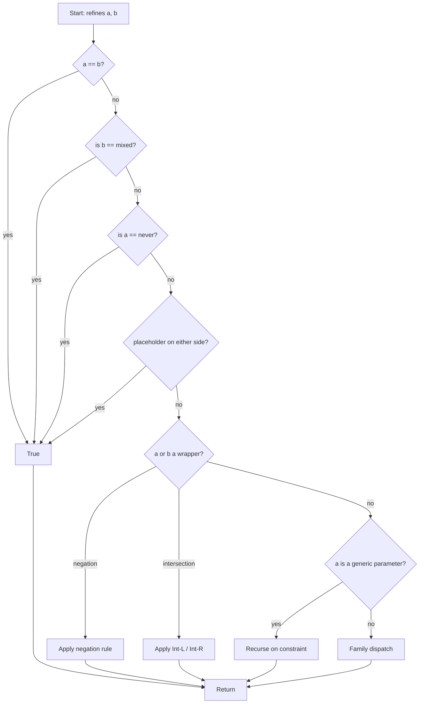

# Subtyping: refines

The subtype relation $\tau \mathrel{<:} \sigma$ is suffete's most important operation. Read it as: *every value of type $\tau$ is also a value of type $\sigma$*.

## Reading the rules

The lattice rules read as a dispatch tree: first, the universal axioms ; then, family-specific rules ; then, fall through to false. The dispatch happens at the *Element* level, not the *Type* level: the Type-level rule is just "every Element on the left must refine some Element on the right", with a few cross-cutting collapse rules.

### Type-level rule

For Types $\tau, \sigma$:

$$\tau \mathrel{<:} \sigma \quad\iff\quad \forall e \in \tau,\;\; e \mathrel{<:} \sigma$$

(Read $e \mathrel{<:} \sigma$ as: there exists some Element in $\sigma$ that the Element $e$ refines, OR a *fan-out* coverage rule fires that lets a single Element be covered by a union of Elements on the right.)

The fan-out rules let the lattice handle cases like `int<-∞, 0>` refining `int<-∞, -1> | int(0)` ; no single Element on the right covers it, but the union does. The rules are:

- **Int union coverage** — an integer range may be covered by a sorted union of integer ranges and literals.
- **String union coverage** — a string literal is covered by an unspecified string with matching axes, or by another literal.
- **List union coverage** — a sealed list is covered by a union of unsealed lists with element types covering the known positions.
- **Array union coverage** — same for keyed arrays.
- **Intersected partition coverage** — an intersection may be covered by a union if each part of the intersection is.
- **Negation partition coverage** — a negation of a finite-cover universe (such as `bool` or an enum) may be covered by the union of its complement.

These coverage rules are why the rules are more elaborate than the textbook "for-each-on-the-left, exists-on-the-right" rule.

## Universal axioms

| Rule | Reading |
|---|---|
| **Reflexivity** | $a \mathrel{<:} a$ for every Element. |
| **Bottom** | $\bot \mathrel{<:} a$ for every Element. ($\bot$ has no values; the universal "every value of $\bot$ is a value of $a$" holds vacuously.) |
| **Top** | $a \mathrel{<:} \top$ for every Element. (Every value is in $\top$.) |
| **Placeholder** | placeholder refines and is refined by everything (inference convenience; should not appear in finalised types). |

The order is significant: the universal axioms fire first, the family dispatch last.

## Family dispatch

Dispatch is by the family of the right-hand side (the container) and then by the family of the left-hand side (the input). One rule set per family ([objects](../universe/objects.md), [arrays](../universe/arrays.md), [scalars](../universe/scalars.md), etc.) plus the [wrappers](../universe/wrappers.md) and [unresolved elements](../universe/unresolved.md).

| Container | Input | Rule |
|---|---|---|
| `int` | `int` | range / literal subtyping |
| `float` | `float` | float-family rules |
| `string` | `string`, class-like-string | string axis subset, literal flags |
| class-like-string | class-like-string | kind + specifier rules |
| `bool`, `true`, `false` | `bool`, `true`, `false` | trivial subtype rules |
| object family | object family | named, shape, has-method, etc. |
| `array`, `list` | `array`, `list` | sealed, optional, variance |
| `iterable` | `array`, `list`, named class | `Traversable` etc. |
| `callable` | `callable` | return covariant, params contravariant |
| `resource` | `resource` | state + kind axes |
| `scalar` / `numeric` / `array-key` | (decomposed) | true-union dominator covers |
| negation | (anything) | the negation rules below |
| intersection | (anything) | the Int-L / Int-R rules below |
| `mixed` | (anything) | narrowed-mixed axis rules |
| generic parameter | (anything) | constraint projection |
| alias / reference / ... | (anything) | unresolved — caller must expand first |

## The wrapper rules

### Negation on the right

$a \mathrel{<:} \neg b$ iff $a \sqcap b \equiv \bot$ (i.e. $a$ is disjoint from $b$).

Example: `int <: !string` iff `int` is disjoint from `string` ; true.

### Negation on the left

$\neg a \mathrel{<:} b$ iff $\neg b \mathrel{<:} a$ (Boolean duality), with caveats. When $a$ has a finite cover (e.g. `bool` is `true | false`), the lattice can directly check whether the complement is contained in $b$.

### Intersection on the right (Int-R)

$\tau \mathrel{<:} (H \sqcap C_1 \sqcap \dots \sqcap C_n)$ iff $\tau \mathrel{<:} H$ and $\tau \mathrel{<:} C_i$ for every $i$.

Conjunction-of-refinements: the container demands $\tau$ refine *every* part.

### Intersection on the left (Int-L)

$(H \sqcap C_1 \sqcap \dots \sqcap C_n) \mathrel{<:} \sigma$ iff $H \mathrel{<:} \sigma$ or some $C_i \mathrel{<:} \sigma$.

Disjunction-of-refinements: the intersection refines $\sigma$ when *some* part already does.

The asymmetry is critical: intersection on the left is *easier* to refine into something (any part can do the work); intersection on the right is *harder* to refine into (every part must accept).

## The mixed-axes rule

If the container is `mixed` with axes $A$, the input refines it iff every axis in $A$ is implied by the input. The implications are listed in [refinement axes](../universe/refinements.md).

Example: `int <: non-null mixed` ; the non-null axis is structurally guaranteed by `int`.

## Generic-parameter projection

Free template parameters are treated as their constraint for the purpose of subtyping.

- **Left**: $T \mathrel{<:} \sigma$ iff $\mathit{constraint}(T) \mathrel{<:} \sigma$.
- **Right**: $\tau \mathrel{<:} T$ iff $\tau \mathrel{<:} \mathit{constraint}(T)$ (with extra checks; see [variance](../generics/variance.md)).

The same parameter on both sides reflexively refines (rule 1, equality). Two parameters with different defining entities are different parameters; whether they refine each other depends on their constraints.

## Coercion edges

PHP allows certain non-subtype coercions on parameter boundaries: `int` can flow into a `float` parameter, for example. The lattice has a single toggle to admit these on demand:

| Edge | Source | Target |
|---|---|---|
| `int` → `float` | int parameter | float parameter |
| `numeric-string` → `int` | string parameter | int parameter (with cast) |
| `numeric-string` → `float` | string parameter | float parameter (with cast) |

The default is to admit these (matches PHP's loose-types behaviour); analysers in strict-types mode disable them. When a coercion edge fires, it is recorded so the analyser can warn.

## Disjointness

`refines` decides $\tau \mathrel{<:} \sigma$. For the symmetric question "do these two types share any value?", use [overlaps](./overlaps.md).

## Visualising the dispatch



## A worked example

```php
/** Inputs */
$a = int|string;
$b = int|string|null;
```

`$a <: $b` ; every Element of `int|string` (namely `int` and `string`) refines some Element of `int|string|null`. Trivial.

`$b <: $a` is false ; the `null` on the left does not refine any Element on the right. No fan-out applies.

> **See also:** [overlaps](./overlaps.md) for the symmetric "share a value?" question; [meet](./meet.md) for the operation that produces a type rather than a boolean; [laws](./laws.md) for the algebraic identities the implementation is required to satisfy.
