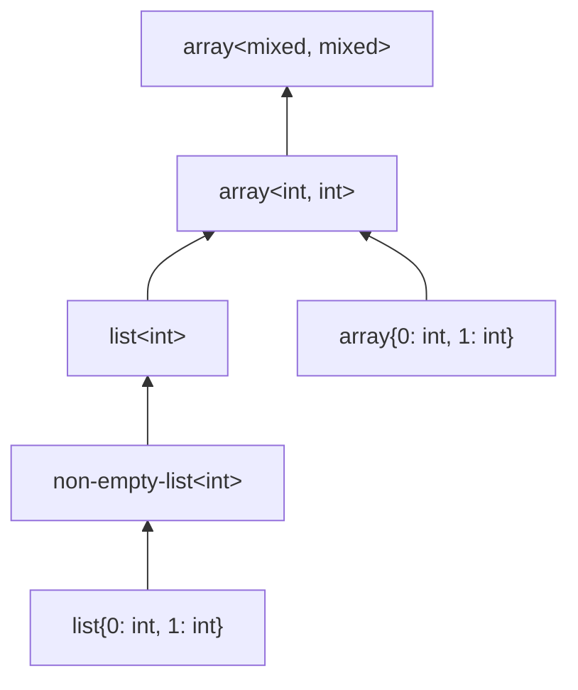

# Arrays and lists

PHP has one runtime collection type — the array — but the type system distinguishes two views of it: **keyed arrays** (the general form, with key and value parameters) and **lists** (int-keyed, contiguous, with a single element type). Both views support generic and **shape** forms. Shapes can be **sealed** or **unsealed**.

| PHP-side | Denotes |
|---|---|
| `array<K, V>`, `array{a: int, b?: string, ...}`, `array{}` | Keyed array. |
| `list<T>`, `non-empty-list<T>`, `list{0: int, 1: string, ...}` | Int-keyed contiguous list. |

This chapter describes what each *means*. The lattice rules for subtyping, meet, join, and so on are in [refines](../lattice/refines.md), [meet](../lattice/meet.md), and [join](../lattice/join.md).

## Keyed arrays

A keyed array can be in one of four states:

| State | PHP-side | Notes |
|---|---|---|
| **Generic** | `array<K, V>`, `non-empty-array<K, V>` | `K` and `V` are type parameters. Unsealed: any extra entries allowed. |
| **Open shape** | `array{a: int, ...}` | Specific known entries plus a rest type for unknown entries. |
| **Sealed shape** | `array{a: int}` | Specific entries; no extras. |
| **Empty** | `array{}` | The single empty array. |

### Known entries

A shape's entries each carry:

- A **key** (an integer literal like `0`, a string literal like `"name"`, or a class constant like `Foo::KEY`).
- A **value type**.
- An **`optional`** flag (PHP `?`: `array{name?: string}`).

The lattice's [refines](../lattice/refines.md) chapter has the full required-vs-optional rules.

### Sealed vs unsealed

A **sealed** shape commits to having no entries beyond those listed. An **unsealed** shape allows additional entries (governed by the rest-type parameters). The lattice consequences:

- `array{a: int, b: string}` (sealed) refines `array{a: int}` (sealed) only if the input has *exactly* the keys the container does (extras are forbidden).
- `array{a: int, b: string}` (sealed) refines `array{a: int, ...}` (unsealed) by ignoring the extras.
- `array{}` refines every keyed-array container that admits empty (i.e. is not `non-empty-array`).

### `non-empty-array`

The non-empty axis asserts that the array has at least one entry. A shape with at least one *required* entry is automatically non-empty; the explicit form exists for the generic case.

## Lists

A list is structurally an int-keyed array with contiguous keys starting at 0. Suffete carries it as a separate family because PHP analysers commonly distinguish them and many operations are sharper in list-shape (the keys are positional, not arbitrary).

| State | PHP-side | Notes |
|---|---|---|
| **Generic** | `list<T>`, `non-empty-list<T>` | Single element type. |
| **Open with known head** | `list{0: int, ...<T>}` | Sealed prefix plus a rest element type. |
| **Sealed** | `list{0: int, 1: string}` | Fixed-shape list. |

### Known elements

Indices start at 0; required entries must be contiguous from 0. Optional entries can be skipped only at the tail (PHP supports `[int, int, ?string]` but not `[int, ?int, int]`).

### Cross-family relationships

- `list<int>` refines `array<int, int>` ; lists are int-keyed arrays.
- `non-empty-list<int>` refines `list<int>` ; non-empty is a strict refinement.
- `list{0: int, 1: string}` (sealed) refines `list<int|string>` ; sealed-vs-generic with element-type covering all known types.
- An empty sealed list (`list{}`) is uninhabited if combined with `non-empty`.

## How keyed arrays and lists relate



A list refines a keyed-array of compatible parameters when the container's key parameter accepts `int` and the value parameter accepts the list's element type.

## A worked example

```php
/**
 * @param array{name: string, age: int} $u
 */
function f(array $u): void { /* ... */ }

f(['name' => 'Hannibal', 'age' => 24]);  // OK: matches the shape
f(['name' => 'Hannibal']);               // FAIL: missing required 'age'
f(['name' => 'Hannibal', 'age' => 24, 'rank' => 'general']); // FAIL: extra key, sealed
```

The parameter is a sealed keyed-array shape; the argument types are inferred (or user-annotated) sealed shapes. The sealed-vs-sealed rule fires and decides each case.

## Intersections

`array<K, V> & SomeConjunct` and `list<T> & SomeConjunct` are expressed via the [`Intersected`](./wrappers.md) wrapper.

> **See also:** [refines](../lattice/refines.md) for the per-pair subtype rules; [iterables and callables](./iterables-callables.md) for how arrays relate to `iterable<K, V>`; [meet](../lattice/meet.md) for sealed-shape intersection.
