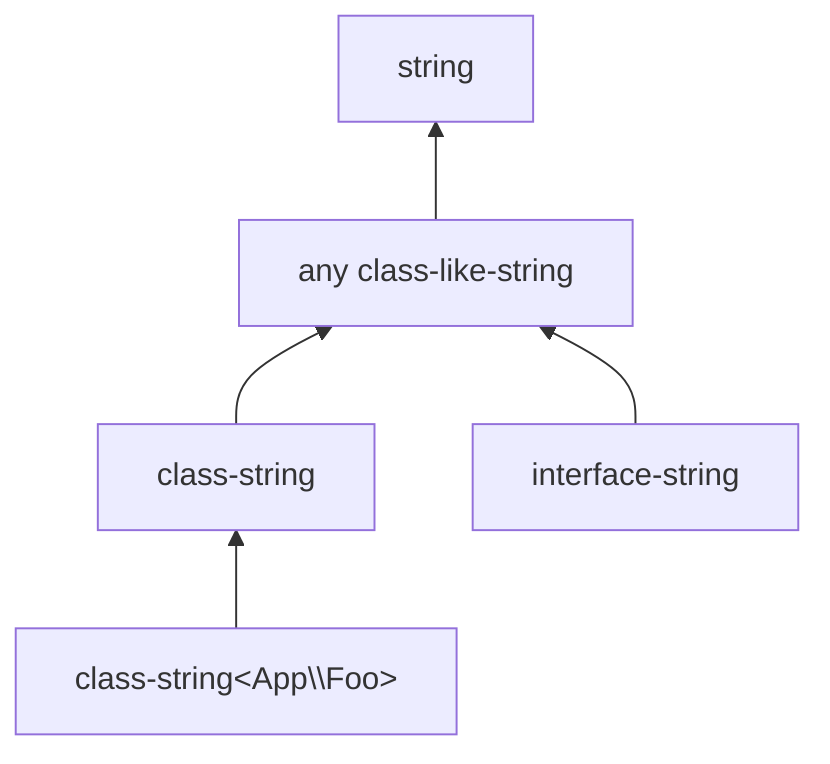

# Class-like strings

A *class-like string* is a `string` value whose runtime content is the fully-qualified name of a class, interface, trait, or enum. PHP-side: `class-string`, `class-string<Foo>`, `interface-string`, `enum-string`, `trait-string`. The type system uses these to track the connection between a string-as-name and the class it refers to.

## The two axes

Every class-like string has two axes:

### Kind

Five values, one per family:

- **`class`** — only class names (excluding interfaces, traits, enums).
- **`interface`** — only interface names.
- **`trait`** — only trait names.
- **`enum`** — only enum names.
- **`unspecified`** — any of the above.

`unspecified` is the join of the others. The lattice's [refines](../lattice/refines.md) chapter has the per-pair rules.

### Specifier

How specific the class-name is:

- **Unspecified** — the `class-string` form, no commitment to a particular class.
- **Literal** — the `class-string<Foo>` form, where the FQN is known.
- **Of a type** — `class-string<T>` where `T` is some bounded form (the analyser substitutes through this when `T` is bound).
- **Generic** — the `::class` lookup on a generic parameter, before the parameter is substituted.

## Subtyping

A class-like string refines another by both axes:



- The kind axis: `class` $\mathrel{<:}$ `unspecified`, `interface` $\mathrel{<:}$ `unspecified`, etc. Different specific kinds are disjoint (a class-string is not an interface-string).
- The specifier axis: a literal `class-string<Foo>` refines a literal `class-string<F>` iff the analyser confirms `Foo` descends from `F`.

The cross-cutting check is that a class-like string is also a string ; every class-like string refines `string`.

## Why a separate form

PHP's `class-string<Foo>` is not just "a string that happens to spell `Foo`"; it carries the analyser's knowledge that the string can be passed to `new`, used in `is_a()`, paired with `instanceof`, and so on. Modelling it as a refinement of a plain string would lose the connection. Modelling it as its own form preserves the connection and lets the lattice apply class-hierarchy reasoning where needed.

## A worked example

```php
/** @param class-string<Throwable> $cls */
function throw_named(string $cls): never {
    throw new $cls('boom');
}

throw_named(RuntimeException::class);  // OK
throw_named(stdClass::class);          // FAIL: stdClass does not descend from Throwable
```

The parameter is `class-string<Throwable>`. The arguments are `class-string<RuntimeException>` and `class-string<stdClass>`.

The lattice asks the analyser: does `RuntimeException` descend from `Throwable`? (yes). Does `stdClass`? (no). It returns the matching answer.

## Crossing into `string`

A `class-string<Foo>` refines `string` directly. A `string` does *not* refine `class-string<Foo>` — most strings are not class names.

The other direction matters for narrowing: an analyser observing `class_exists($s)` returning `true` can narrow `$s` from `string` down to `class-string`. The [narrow](../lattice/narrow.md) operation handles this when the analyser supplies the assertion.

> **See also:** [scalars](./scalars.md) for the `string` family; [refines](../lattice/refines.md) for the per-pair rules.
