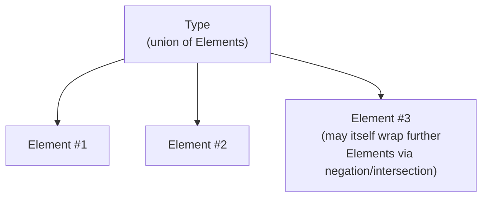

# Elements: the indivisible types

Every type in suffete is a finite **union** of **Elements**. An Element is the smallest unit a type is built from — a single integer, the unconstrained string, the named class `Foo`, the negation of `null`. A type with one Element is a singleton; a type with several is a union of those.

The PL-theory term for an Element is **atom**. The two terms are interchangeable; the book uses "Element" to match the code. (See the [glossary](../foundations/glossary.md) and the introduction note on naming.)

## The split

A type lives at two levels:

- **Element** — one indivisible piece. `int` is an Element. `null` is an Element. `list<int>` is an Element. `Foo & Bar` is an Element (an intersection wrapping a head and a conjunct).
- **Type** — a union of Elements, plus a small bag of flow-flag metadata. `int|string` is a type with two Elements. `list<int>` is a type with one Element.

Singletons are still types: `int` (the type) is a one-element type containing the `int` Element. The Type/Element distinction is what lets the union machinery be straightforwardly set-of-elements without every operation having to handle "what if this is one element" specially.



## Element kinds, by family

The universe groups into families. The next chapters of Part II cover each family in detail; this section is a one-screen index.

### Scalars

The PHP scalar primitives, plus their unions and refinements.

- `int`, `float`, `string`, `bool`, `true`, `false`
- `numeric` (the disjoint union `int | float | numeric-string`)
- `scalar` (the disjoint union `bool | int | float | string`)
- `array-key` (the disjoint union `int | string`)
- `class-string`, `interface-string`, `enum-string`, `trait-string`

See [scalars](./scalars.md) and [class-like strings](./class-like-string.md).

### Special elements

The well-known landmarks that are not values themselves but anchors in the lattice.

- `null` (the value `null`)
- `void` (the absence of a return; treated as falsy and not-null per PHP semantics)
- `never` (the empty type, $\bot$ — a function that never returns has return type `never`)
- `mixed` (the unconstrained universe top, $\top$, plus its narrowed variants carrying truthiness/non-null/non-empty axes)
- `placeholder` (an inference hole)

See [special elements](./special.md).

### Object family

The forms that describe an object reference at runtime.

- Named classes (`Foo`, `Foo<int>`, with optional `static` / `$this` modality)
- The unconstrained `object`
- Enums (whole `Status`, or a single case `Status::Active`)
- Structural shapes (`object{name: string, age: int}`)
- `has-method<m>` and `has-property<p>` predicates

See [objects, enums, and structural object types](./objects.md).

### Array / list family

PHP's two array views, in their generic and shape forms.

- Keyed arrays: `array<K, V>`, sealed `array{a: int, ...}`, the empty `array{}`
- Lists: `list<T>`, `non-empty-list<T>`, sealed `list{0: int, ...}`

See [arrays and lists](./arrays.md).

### Iterable / callable

- `iterable<K, V>`
- `callable`, plus signatures and closures

See [iterables and callables](./iterables-callables.md).

### Resources

- `resource`, `open-resource`, `closed-resource`, plus optional named kinds (`resource<curl>`)

See [resources](./resources.md).

### Wrappers

The two combinators that *contain* other Elements.

- Negation: $\neg \tau$
- Intersection: $H \sqcap C_1 \sqcap \dots \sqcap C_n$

See [wrappers](./wrappers.md).

### Unresolved elements

Forms that name a future resolution rather than carrying its result. Lattice operations on these route through [expansion](../api/expand.md).

- Aliases (a type alias, name-only)
- References (`T` referenced by name, before binding)
- Member references (`Foo::T`)
- Global references
- Conditional types (`T extends U ? X : Y`)
- Derived types (`key-of<T>`, `value-of<T>`, `T[K]`, ...)
- Inference variables (analyser-introduced placeholders)

See [unresolved elements](./unresolved.md).

### Generics

- Free template parameters (`T` inside a generic class declaration, with its constraint, defining entity, and qualifier)

See [templates](./templates.md) and [Part IV](../generics/templates.md).

## Closure

The Element universe is **closed under the lattice operations** in the following sense: every well-formed application of `meet`, `join`, `subtract`, or `narrow` to two types produces another well-formed type. The result may be $\bot$ (`never`) or $\top$ (`mixed`), or it may be a wrapper (negation / intersection) — but it is always a type that can itself be the input to further operations.

The unresolved kinds break this closure on the *lattice* side: the lattice is not directly defined on aliases, references, conditionals, etc. The contract is that those are expanded out before the lattice is asked anything important. See [expand](../api/expand.md) for the operation, and [unresolved elements](./unresolved.md) for the kinds.

## A worked example

The PHP type:

```
non-empty-list<int>|null
```

is a type with two Elements: the `non-empty-list<int>` element and the `null` element. The order in which they were constructed is irrelevant; the universe canonicalises unions so that any two paths to the same value-set produce the same type.

> **See also:** [Element kinds](../reference/element-kinds.md) for the exhaustive list with one-line descriptions; [Constructing types](../api/construction.md) for the API used to build them.
