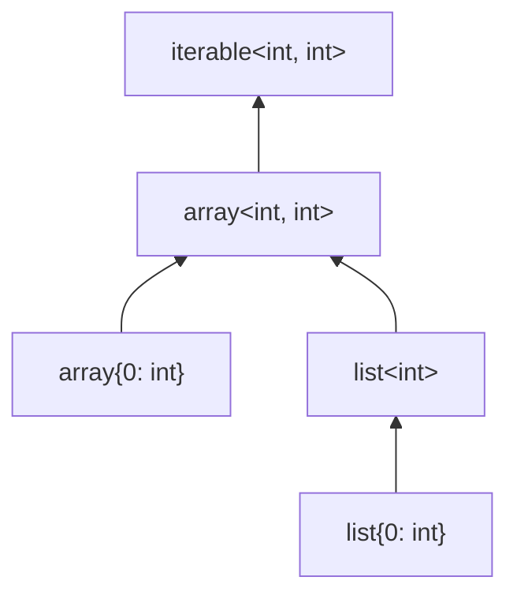

# Iterables and callables

Two PHP types that are not values themselves but commitments about what a value supports: `iterable<K, V>` says "this can be foreached over", and `callable` says "this can be invoked".

## `iterable<K, V>`

PHP-side: `iterable<K, V>`. Denotes any value that can be iterated with `foreach`: an array, a `Traversable`, a generator, an `IteratorAggregate`, and so on.

`iterable` is its own family because `array <: iterable` and `Traversable <: iterable` both hold, but `iterable` does not commute with arbitrary classes; it must be tracked as its own thing.

### Subtyping

`iterable` is the supertype of every `array`, `list`, and `Traversable` (or descendant). The variance is *covariant on K and V*: `iterable<int, Foo>` refines `iterable<int, object>`.

The lattice handles:

- `array<K, V>` refines `iterable<K, V>` ; arrays are iterable, with the same key/value parameters.
- `list<T>` refines `iterable<int, T>` ; lists key by int.
- `Traversable<K, V>` (or any descendant) refines `iterable<K, V>` ; the analyser supplies the variance via the codebase model.

Note that `iterable` sits *above* `Traversable<K, V>` ; not all iterables are traversables (an `array` is iterable but not a `Traversable`).

### Intersections

`iterable<K, V> & Countable` is expressed via the [`Intersected`](./wrappers.md) wrapper.

## `callable`

PHP-side: `callable`, plus the more refined `callable(int): string`, `Closure(int): string`, and so on.

Three variants:

- **Bare `callable`** — no signature commitment. Any callable: a function name string, a `Closure`, an `[$obj, 'method']` array, an `__invoke`-bearing object.
- **`callable(...): T`** — the open form with a declared signature. Includes any of the above whose effective signature refines the declared one.
- **`Closure(...): T`** — strictly the `Closure` class instance with the declared signature.

### Signatures

A signature has parameters, a return type, and a `throws` clause:

- **Parameters**: each one carries a type, plus `optional` / `variadic` / `by_reference` flags. The optional `name` is for diagnostic alignment; it does not affect typing.
- **Return type**: covariant.
- **Throws**: declared exception types (PHPDoc).

### Variance

The standard rules for callables:

- **Return type is covariant.** A callable returning `Foo` refines a callable returning `Bar` iff `Foo` refines `Bar`.
- **Parameter types are contravariant.** A callable taking `Bar` refines a callable taking `Foo` iff `Foo` refines `Bar`.
- Optional / variadic / by-reference must align in the obvious way.

## How `iterable` relates to `array` and `list`

A partial order:

A list refines a keyed-array of compatible parameters; a keyed-array refines an iterable of compatible parameters.

> **See also:** [arrays and lists](./arrays.md); [refines](../lattice/refines.md) for the variance rules.
