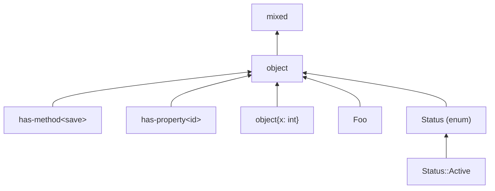

# Objects, enums, and structural object types

PHP objects can be referenced six ways. Five describe a *runtime* object; one (`has-method`/`has-property`) describes only a structural property the runtime object must have.

| PHP-side | Denotes |
|---|---|
| `Foo`, `Foo<int>`, `Foo & Bar` | A named class, with optional template arguments. |
| `object` | Any object, no class commitment. |
| `Status`, `Status::Active` | A backed or pure enum, possibly narrowed to a single case. |
| `object{name: string, age: int}` | A structural object: any object that has these properties. |
| `has-method<save>` | Anything that declares method `save`. |
| `has-property<id>` | Anything that declares property `id`. |

This chapter describes what each *means*. The lattice rules (subtyping, meet, etc.) live in [refines](../lattice/refines.md) and the operation chapters.

## Named classes (`Foo`)

A reference to a specific class, optionally instantiated with template arguments and/or marked with a late-static modality (`static`, `$this`).

### Type arguments

When a class is generic (`@template T`), the user supplies the arguments at the use site. If the class declares more parameters than the user supplies, the missing ones are filled with their declared upper bounds and marked as **default-filled** so downstream variance checks know to skip them. If the user supplies more than the class declares, the surplus is dropped (truncated to the declared arity). This collapses `Box<int, string>` and `Box<int>` to the same form when `Box` declares one parameter.

### Modality flags

Three flags govern the late-static modality:

- **`is_this`** — `$this` (the receiver). Strongest.
- **`is_static`** — the late-static class. Weaker than `is_this`.
- **`remapped_parameters`** — analyser-internal marker for an inheritance-binding remap.

`is_this` implies `is_static`. The modality check at refinement time:

- A container marked `is_this` accepts only `is_this` inputs.
- A container marked `is_static` accepts `is_static` or `is_this` inputs.
- A plain `Foo` accepts any of the above.

### Intersections

`Foo & Bar` is expressed via the [`Intersected`](./wrappers.md) wrapper, with `Foo` as head and `Bar` as a conjunct.

## `object` (the unconstrained form)

The "some object, class not committed". Used when the analyser knows the value is an object but has not pinned down a class. Refines `mixed`; refined by every named class, enum, structural shape, and `has-*` form.

## Enums

PHP enums can be *backed* (`enum Status: string { case Active = 'active'; ... }`) or *pure* (`enum Color { case Red; ... }`). The type system models them with two forms:

- `Status` — the whole enum (any case).
- `Status::Active` — the single case.

A vanilla `Status` is the join of all its cases. A specific case is a strict subtype of the enum. Two cases of the same enum are disjoint.

An enum case behaves *structurally* like an object shape with a `name` property (always present) and a `value` property (present only on backed enums). The lattice synthesises that shape on demand, so `Status::Active` refines `object{name: string}` automatically.

## Structural object types (`object{...}`)

A structural object type is a list of declared properties (each with a name, a type, and an optional flag) plus a `sealed` bit.

### Sealed vs unsealed

- An **unsealed** shape `object{name: string, ...}` is satisfied by any object that has at least the listed properties (with refining types). Extra properties are allowed.
- A **sealed** shape `object{name: string}` is satisfied by an object that has *exactly* those properties.

The sealed-vs-sealed rule mirrors the keyed-array rule (see [arrays](./arrays.md)): every required key in the container must be present in the input shape with a refining value, and the input cannot introduce required keys the container does not list.

### Optional properties

A property can be marked optional (`name?: string`). Required is a strict subtype of optional ; the input is more committal.

### Intersections

`object{x: int} & has-method<draw>` is the [`Intersected`](./wrappers.md) wrapper with the shape as head and `has-method<draw>` as conjunct.

## `has-method<m>`

PHP-side: `has-method<m>`. Denotes "anything that declares a method called `m`". No commitment to a specific class.

`A` refines `has-method<m>` iff one of:

- `A` is `has-method<m>` itself (the same method name).
- `A` is a named class `C` and the analyser confirms `C` declares (or inherits) `m`.
- `A` is an enum and the enum declares `m`.

The lattice asks the analyser's codebase model. If it does not know, the conservative answer is "no" ; better to over-reject than to under-reject.

Multiple `has-method` constraints chain through the [`Intersected`](./wrappers.md) wrapper: `has-method<save> & has-method<delete>`.

## `has-property<p>`

Symmetric to `has-method`, with `p` as the property name. The lattice handles the `value` property specially for backed enums (see above). Beyond that, the rules are the same.

## How the kinds compose



Every member of the object family refines `object`; `object` refines `mixed`.

Within the family:

- `Foo` refines `object{x: int}` if the analyser records that `Foo` has a property `x` whose declared type refines `int`.
- `Foo` refines `has-method<m>` if the analyser records that `Foo` (or an ancestor) declares `m`.
- `object{x: int, y: string}` refines `object{x: int}` (sealed-vs-unsealed: extra key allowed).
- `object{x: int}` does *not* refine `object{x: int, y: string}` ; the input is missing `y`.

## A worked example

```php
function f(Stringable $x): string {
    return $x->__toString();
}

class Foo {
    public function __toString(): string { return 'foo'; }
}

f(new Foo()); // OK if Foo implements Stringable
```

The parameter is the named class `Stringable`. The argument is the named class `Foo`. The lattice asks the analyser's codebase model: does `Foo` descend from `Stringable`? If yes, the call type-checks.

A subtler example with a structural type:

```php
/**
 * @param object{handle: resource} $obj
 */
function process($obj): void { /* ... */ }
```

The parameter is a structural `object{handle: resource}`. Passing a `Database` instance succeeds iff the analyser confirms `Database::handle` exists with a type that refines `resource`.

> **See also:** [refines](../lattice/refines.md) for the full subtype rules across the object family; [wrappers](./wrappers.md) for the `Intersected` representation.
