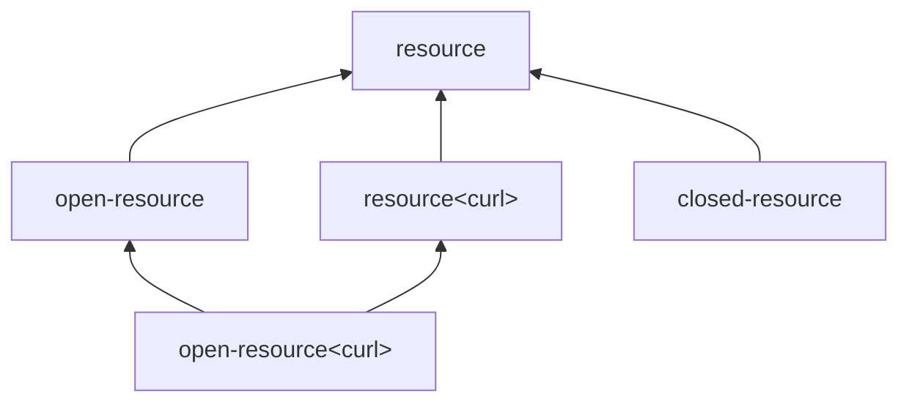

# Resources

PHP's `resource` is a runtime handle to an external resource: a file, a database connection, a stream, a curl handle. The type system models this as the `resource` family, with optional refinements for the resource's open-or-closed state and its named kind.

## The two axes

A resource carries two refinement axes:

### State

Three values:

- **Unspecified** — the analyser has no knowledge of openness. PHP-side: `resource`.
- **Open** — the resource is open. PHP-side: `open-resource`.
- **Closed** — the resource is closed. PHP-side: `closed-resource`.

`Open` and `Closed` are disjoint. `Unspecified` is the join.

The state tracks the result of `fclose($f)` and similar calls in the analyser: after `fclose($f)`, the analyser narrows `$f` from `open-resource` to `closed-resource`.

### Kind

An optional named kind — `resource<curl>`, `resource<gd image>`, `resource<stream>`. The name corresponds to PHP's `get_resource_type($r)` return value.

A resource without a named kind admits any kind. With a name, it admits only that specific kind.

## Subtyping



- `Open` refines `Unspecified` ; `Closed` refines `Unspecified` ; both refine the unrefined.
- A named kind refines the unnamed; `open-resource<curl>` (state = `Open`, kind = `curl`) refines both `open-resource` and `resource<curl>`.

## A worked example

```php
/**
 * @param open-resource $r
 */
function read($r): string { /* ... */ }

$f = fopen('/tmp/x', 'r');     // open-resource<stream>
read($f);                      // OK: open-resource<stream> <: open-resource
fclose($f);                    // narrows $f to closed-resource<stream>
read($f);                      // analyser warns: passed a closed resource
```

The lattice answers each `refines` query straightforwardly. The narrowing on `fclose` is the [narrow](../lattice/narrow.md) operation with an analyser-supplied assertion that the resource is now `Closed`.

> **See also:** [refines](../lattice/refines.md) for the per-pair rules; [narrow](../lattice/narrow.md) for state-flip narrowing.
