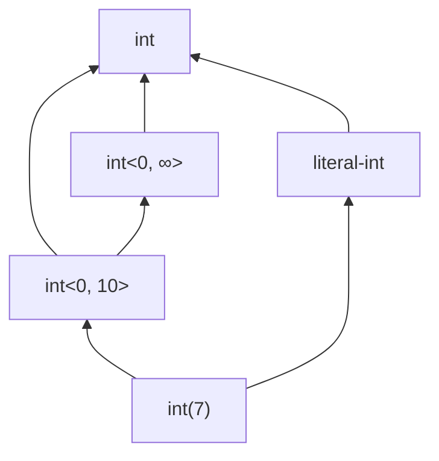
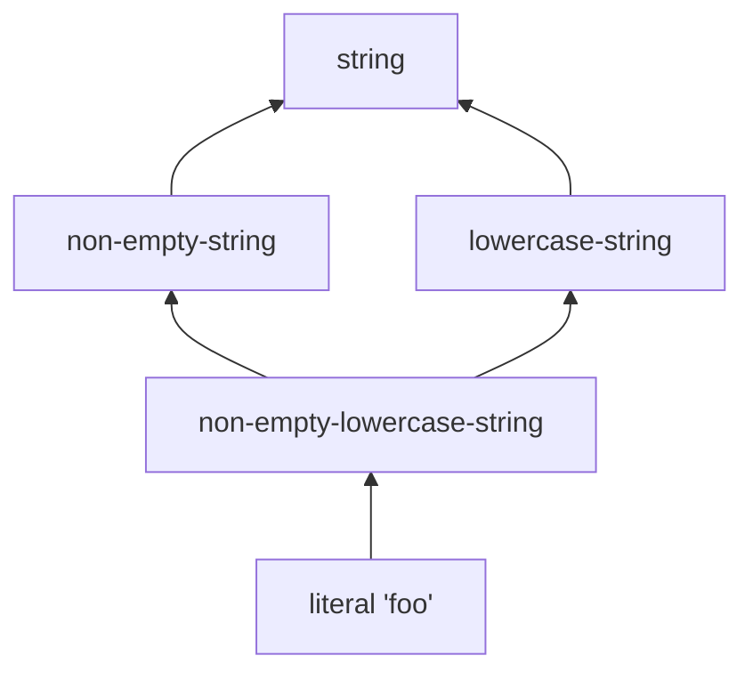

# Scalars

The scalar family is PHP's primitive value space: integers, floats, strings, booleans, plus the cross-cutting unions `numeric`, `scalar`, and `array-key`. Every scalar admits refinement: a literal value, a bounded range, a string with declared casing or non-empty flag, a boolean specialised to `true` or `false`.

## Integers

`int` is the family for some integer. Four refinement levels:

| PHP-side | Denotes |
|---|---|
| `int` | Any integer. |
| `literal-int` | Some integer literal (the value is unknown, but the analyser knows it is a literal, not a computed result). |
| `int(7)`, `7` | The single integer `7`. |
| `int<0, 100>`, `int<-∞, 0>`, `int<0, ∞>` | A closed integer range (bounds may be open on either side). |

### Subtyping among `int` variants



- `int(n)` refines `int<lo, hi>` iff $n \in [lo, hi]$.
- `int<lo', hi'>` refines `int<lo, hi>` iff $[lo', hi'] \subseteq [lo, hi]$.
- Every `int` variant refines plain `int`.
- `int(n)` refines `literal-int`; `literal-int` refines `int`.

### Range arithmetic

The lattice operations on ranges are interval arithmetic with optional infinite bounds. Meet of two ranges is their intersection (becomes `never` if disjoint); join is the smallest range containing both. Ranges of one literal collapse to a literal; ranges that grow past a threshold widen to `int`.

## Floats

Three refinement levels:

| PHP-side | Denotes |
|---|---|
| `float` | Any float. |
| `float(3.14)`, `3.14` | The single float literal. `0.0` and `-0.0` are distinct under PHP's identity comparison. |
| (analyser-internal) | A float that is provably non-zero. Used by the truthiness machinery rather than appearing in user-written types. |

There is no PHP-side range form for floats — the precision questions involved (denormals, NaN, signed zero) make ranges more trouble than they are worth.

## Strings

The richest scalar. A string carries a literal slot plus a small bag of refinement flags:

| Flag | PHP-side | Meaning |
|---|---|---|
| `non-empty` | `non-empty-string` | The string is at least one character. |
| `truthy` | `truthy-string` | Truthy at runtime (excludes `""` and `"0"`). |
| `lowercase` | `lowercase-string` | Every character is lowercase. |
| `uppercase` | `uppercase-string` | Every character is uppercase. |
| `numeric` | `numeric-string` | Parses as an integer or float. |

These are *axes* — combinations are valid: `non-empty-lowercase-string` carries both bits.

### Subtyping among `string` variants



- A literal refines an unspecified string with flags iff the literal value satisfies every flag (e.g. literal `"foo"` refines `non-empty-lowercase-string`).
- Unspecified-with-flags $F'$ refines unspecified-with-flags $F$ iff $F \subseteq F'$ (more flags = stricter).
- `truthy` implies `non-empty` (any non-`""` non-`"0"` string is both).

### Numeric strings

`numeric-string` is the dominator that takes a string into the same family as int and float. It has two refining ancestors: `string` (every numeric-string is a string) and `numeric` (every numeric-string is numeric). The lattice handles both directions.

## Booleans

Three landmarks:

| PHP-side | Denotes |
|---|---|
| `true` | The value `true`. |
| `false` | The value `false`. |
| `bool` | Either of `true` or `false`. |

Subtyping:
- `true` refines `bool`.
- `false` refines `bool`.
- `true` and `false` are disjoint.

The lattice canonicalises `true | false` to `bool` ([join](../lattice/join.md)), and decomposes `bool` into `true | false` when subtracting (e.g. `bool \ true = false`).

## The cross-cutting unions

Three forms are *true unions* — disjoint covers over multiple primitive families, treated as a single name for compactness, and decomposed by the lattice when a question requires it.

### `scalar`

$$\mathit{scalar} = \mathit{bool} \cup \mathit{int} \cup \mathit{float} \cup \mathit{string}$$

Every `bool`, `int`, `float`, or `string` refines `scalar`.

### `numeric`

$$\mathit{numeric} = \mathit{int} \cup \mathit{float} \cup \mathit{numeric{-}string}$$

Same dominator behaviour as `scalar`, but over the smaller cover. `numeric` is *not* a subset of `scalar` directly — they overlap on `int` and `float` but `numeric-string` is a refinement of `string` rather than a direct member of `scalar`.

### `array-key`

$$\mathit{array{-}key} = \mathit{int} \cup \mathit{string}$$

Used in PHP's array keys and as the bound on most generic key parameters. Subsumes every `int` and `string` variant.

## A worked subtype query

```php
function f(int|string $x): bool { /* ... */ }

f(7);            // OK:   int(7) <: int|string
f("hello");      // OK:   literal "hello" <: int|string
f(3.14);         // FAIL: float is disjoint from int|string
```

> **See also:** [Refinement axes](./refinements.md) for the detail on string axes and the analogous mixed axes; [class-like strings](./class-like-string.md) for the strings that name classes; [refines](../lattice/refines.md) for the subtype rules.
