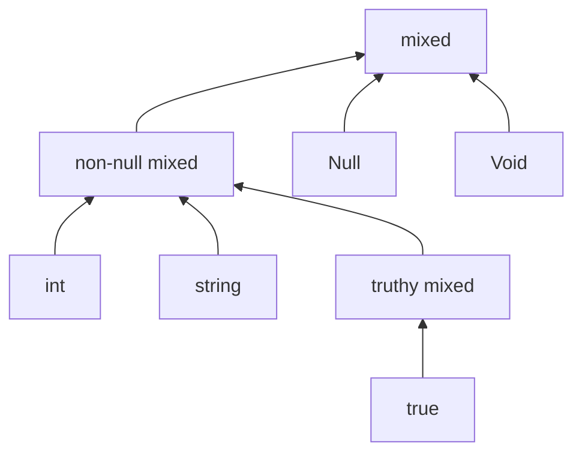

# Special elements

A handful of Element kinds are not values in the ordinary sense; they are landmarks. They mark the bottom and top of the lattice, the absence of a value, the presence of a value that has not yet been resolved, and the universe top with optional axis refinements layered on top. They have outsized impact on the lattice rules, so this chapter treats them in one place.

## `never` ($\bot$)

The empty type. No values inhabit `never`. PHP-side: the return type of a function that never returns (always throws or exits, an infinite loop).

- The bottom of the lattice. Refines every type.
- Disjoint from every type *including itself* — there is no value that inhabits `never`, so $\mathit{never} \sqcap \mathit{never} = \bot$ and $\mathit{overlaps}(\mathit{never}, \mathit{never}) = \mathit{false}$.
- $\mathit{never} \sqcup \tau = \tau$ for every $\tau$. The join unit.
- $\mathit{never} \sqcap \tau = \mathit{never}$ for every $\tau$. The meet annihilator.

## `mixed` ($\top$)

The universal top. Some value, no constraints. PHP-side: `mixed`. It is the type every value-bearing type refines.

`mixed` carries optional **refinement axes** that narrow it without changing its kind:

- **`is_non_null`** — the value is not `null`. PHP-side: `non-null mixed`.
- **`truthiness`** — `Truthy`, `Falsy`, or undetermined. PHP-side: `truthy mixed` / `falsy mixed`.
- **`is_empty`** — analyser-internal marker for "the value is `falsy`".
- **`is_isset_from_loop`** — analyser-internal marker for "this value flowed through a loop body".

A narrowed `mixed` (one or more axes set) sits *between* vanilla `mixed` and the kinds that imply the axis. `non-null mixed` sits above every non-`null`-bearing kind.

The short version of the rules: a type refines `mixed`-with-axes iff every axis the container constrains is implied by the input. `int` refines `non-null mixed` because `int` is structurally non-null. `string` refines `truthy mixed` only when the string is also known truthy.

## `null`

The single value `null`.

- Falsy. Disjoint from every kind that asserts non-null (most kinds — `int`, `string`, `Foo`, etc. — and `non-null mixed`).
- $\mathit{null} \sqcup \tau$ produces a nullable type when $\tau$ does not already admit `null`.
- The lattice's [`narrow`](../lattice/narrow.md) machinery recognises `is_null($x)` / `!is_null($x)` assertions specifically.

## `void`

The absence of a return value. PHP-side: a function declared with return type `void`. The runtime returns the value `null` from such a function, so at every value-flow site `void` is observationally `null` ; the distinction is purely a declarative constraint on the function body (a `: void` return forbids `return $expr`).

- Falsy. Does not refine `non-null mixed` (because the runtime value is `null`).
- **Preserved alone:** a singleton union containing only `void` round-trips as `void`, so a `: void` return-type annotation survives interning.
- **Canonicalised to `null` in any non-degenerate union:** `void | T` (for any value-bearing `T`) becomes `T | null` ; `void | null` becomes `null` ; `void | never` becomes `void` (the `never` is dropped first, leaving `void` alone). This matches PHP runtime semantics: callers of a `void` function see `null`, never a phantom `void` value.

In the original mago bug that prompted this rule, a `match` arm produced `true | void` and the analyser collapsed it to `true`, dropping the null branch entirely. The correct answer is `true | null`, which is what the lattice now produces.

## `placeholder`

The inference-time hole. Marks a position where the analyser knows a type *will* exist but has not yet committed to one. Conceptually `_` in TypeScript or `?` in some inference contexts.

- The lattice treats `placeholder` as $\top$ for the purposes of `refines` and `overlaps` ; everything refines `placeholder` and `placeholder` refines everything. This keeps a partially-inferred type from blocking the analysis until inference completes.
- Should not appear in a finalised type. If you see it after [expansion](../api/expand.md), the analyser failed to commit.

## Summary

| Element | Inhabited? | Position in lattice |
|---|---|---|
| `never` | no | $\bot$ |
| `mixed` (vanilla) | yes (every value) | $\top$ |
| `mixed` (narrowed) | yes | between $\top$ and the kinds that imply the axis |
| `null` | yes (one value) | strict subtype of `mixed` |
| `void` | yes (the runtime value `null`) | strict subtype of `mixed`; preserved alone, canonicalised to `null` in any union of length > 1 |
| `placeholder` | by convention, treated as $\top$ | inference-only |

## Why `mixed` carries axes instead of being wrapped

A natural alternative would be to express narrowed mixed as `mixed & non-null` ; an `Intersected` of `mixed` and a hypothetical `NonNull` element. Suffete instead puts the axes directly on `mixed` for two reasons:

1. **No rule duplication.** With axes attached to the type, the `mixed`-family rules are local. With a wrapper, every other type would need to know how to interact with that wrapper.
2. **Compactness.** `non-null truthy mixed` is one type carrying two bits, not a chain of three nested wrappings.

The trade-off is that `mixed` has special rules in the lattice. Those rules are tested against the algebraic-law battery so the elaboration does not introduce soundness drift.

> **See also:** [Refinement axes](./refinements.md) for the full semantics of the mixed and string axes; [refines](../lattice/refines.md) for the subtype rules; [glossary](../foundations/glossary.md) for the relation $\bot$ to `never` and $\top$ to `mixed`.
