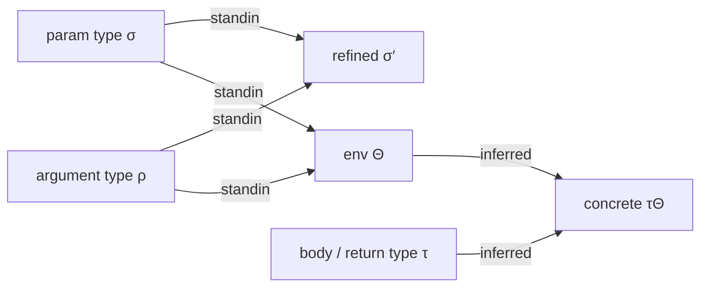
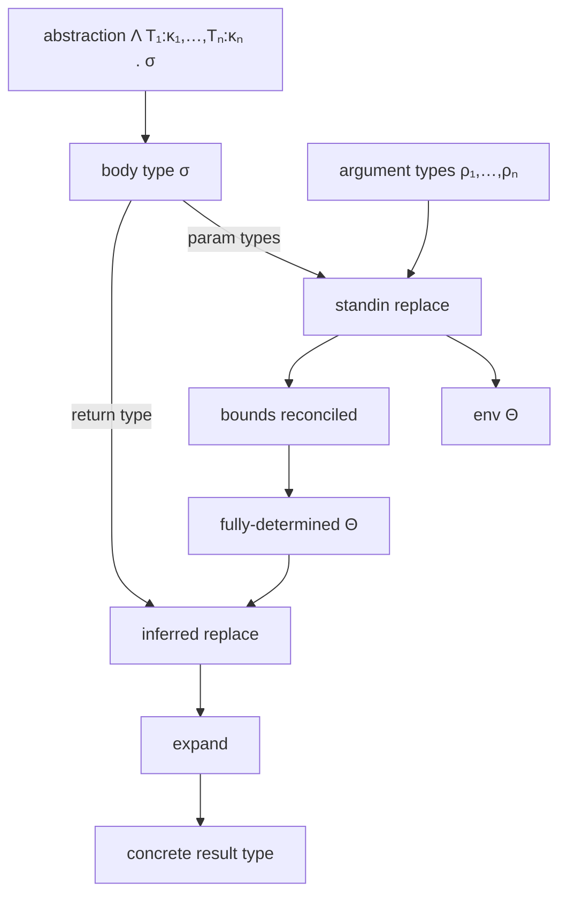

# Generics, Specialisation, Substitution, and Expansion

> Generic abstractions, the inference and substitution that turn them into concrete types, the resolution of non-structural type forms, and the composition of all three.

The vocabulary is fixed in **[types.md](./types.md)** and the notation is summarised in **[README.md](./README.md)**. This chapter assumes both. It also uses the subtyping relation from **[comparison.md](./comparison.md)** for variance and constraint checks, the union operator from **[combination.md](./combination.md)** for bound reconciliation, and the intersection operator from **[intersection.md](./intersection.md)** for upper-bound enforcement.

---

## 1. Generic abstractions

A *generic abstraction* is a class-like, function, method, or closure that introduces zero or more *template parameters*. A template parameter $T$ has:

- A **defining entity** $\Delta$ — the construct that introduces it. Two parameters with the same surface name in different defining entities are distinct.
- A **constraint** (upper bound) $\kappa(T)$ — every concrete witness of $T$ must satisfy $\rho \mathrel{<:} \kappa(T)$. The default constraint is $\top$ (vanilla `mixed`).
- A **variance** $\nu(T) \in \{+, -, \pm\}$ relative to its defining entity (covariant, contravariant, invariant). The default for both function-defined and class-defined parameters is invariant ($\pm$). A class author opts into covariance (`@template-covariant T`) or contravariance (`@template-contravariant T`) only when $T$ appears exclusively in producer or consumer positions inside the class body. Defaulting to anything looser than invariance is unsound for mutable containers (see §1.1).

A generic abstraction with $n$ parameters declares the family

$$\Lambda T_1 : \kappa_1, \dots, T_n : \kappa_n . \, \sigma$$

where $\sigma$ is the abstraction's *body type* — for a class it is the constructed instance type, for a function it is the conjunction of parameter and return signatures.

Every reference to $T$ inside $\sigma$ stands abstractly for "some type satisfying $\kappa(T)$". $T$ has no values until it is *applied*.

### Application

Application supplies type arguments $\rho_1, \dots, \rho_n$ at a use site:

$$(\Lambda T_1 : \kappa_1, \dots, T_n : \kappa_n . \, \sigma) \, \langle \rho_1, \dots, \rho_n \rangle$$

The application is *well-formed* iff $\rho_i \mathrel{<:} \kappa_i$ for every $i$. The application is *evaluated* by substituting $T_i$ with $\rho_i$ throughout $\sigma$, yielding the concrete type $\sigma[T_1 \mapsto \rho_1, \dots, T_n \mapsto \rho_n]$.

### Partial application

A use site may omit type arguments. In that case the parameter defaults to a *standin* — an opaque atom $\widehat{T}$ with constraint $\kappa(T)$ that behaves like a fresh, abstract type until either inference fixes it or the constraint becomes the result.

### 1.1 Why the variance default is invariant

Variance is a per-parameter property determined by where $T$ appears inside the abstraction's body. A parameter is *sound to mark covariant* only when every occurrence of $T$ is in a producer position (return type, read-only field). It is *sound to mark contravariant* only when every occurrence is in a consumer position (function parameter, write-only field). When $T$ appears in both — the typical case for any class with a settable field of type $T$ — the only sound variance is invariant.

A type system that defaults unannotated $T$ to covariant accepts the following unsoundness:

```php
/** @template T */
final class Cell {
    /** @var T */
    public $value;

    /** @param T $v */
    public function set($v): void { $this->value = $v; }

    /** @return T */
    public function get() { return $this->value; }

    /** @param T $v */
    public function __construct($v) { $this->value = $v; }
}

/** @param Cell<scalar> $c */
function store_string(Cell $c): void { $c->set('hi'); }

/** @param Cell<int> $c */
function increment(Cell $c): int { return $c->get() + 1; }

$cell = new Cell(42);   // Cell<int>
store_string($cell);    // accepted under covariant default: int <: scalar
increment($cell);       // runtime: 'hi' + 1, type confusion
```

`Cell<T>` uses $T$ in *both* `set` (consumer, contravariant) and `get` (producer, covariant), so its sound variance is invariant. A covariant-by-default rule accepts the call to `store_string` because `int <: scalar`, which then lets a `string` be written into a slot the call site believes holds an `int`.

For this reason, the default variance for any unannotated template parameter is **invariant**. A class author who has audited their class for producer-only or consumer-only usage opts in explicitly with `@template-covariant T` or `@template-contravariant T`. The type system never silently widens beyond invariance.

---

## 2. Template environments

A **template environment** $\Theta$ is a partial function from template parameters (qualified by their defining entity) to types:

$$\Theta : (\Delta, T) \rightharpoonup \tau$$

The environment is the data structure that records what every in-scope template parameter currently stands for. Substitution is parameterised by $\Theta$.

### Bounds

A template environment may carry, for each $T$:

- **Lower bounds** $\mathcal{L}(T) = \{\rho_1, \dots, \rho_k\}$ — types known to be subtypes of the eventual witness.
- **Upper bounds** $\mathcal{U}(T) = \{\sigma_1, \dots, \sigma_m\}$ — types known to be supertypes of the eventual witness, intersected with $\kappa(T)$.

A *fully-determined* environment fixes a single witness $\Theta(T) = \tau_T$ for each parameter, computed from its bounds (typically $\tau_T = \bigvee \mathcal{L}(T)$). A *partial* environment has empty entries for parameters that have not yet been bound.

### Bound annotations

Each lower bound is decorated with metadata that influences how multiple bounds collected from the same source position are reconciled:

- **Appearance depth** $d \in \mathbb{N}$ — the structural nesting level at which the bound was collected. A bound of depth $0$ comes from the top of the parameter type; depth $k$ comes from inside $k$ generic-parameter applications. Shallower bounds are preferred over deeper bounds when both are present.
- **Argument offset** $i \in \mathbb{N}$ — the call-site argument index that produced the bound. Used to keep bounds separated when invariance forces them to be reconciled per-argument rather than across the call.
- **Equality marker** $\epsilon \in \mathit{ClassLike} \cup \{\bot\}$ — present when the bound was collected through an invariant generic of a specific class-like; that class-like's name is the marker. Equality-marked bounds participate in a stricter reconciliation rule (see §6.3).

The relevant-bounds selection process (§6.3) takes the full list of bounds and returns the subset that contributes to the eventual witness.

### Composition

Two environments compose as substitution composition:

$$\Theta_1 \circ \Theta_2 = \{ (T \mapsto \Theta_1(\rho)) \mid (T \mapsto \rho) \in \Theta_2 \} \cup \{ (T \mapsto \rho) \in \Theta_1 \mid T \notin \mathrm{dom}(\Theta_2) \}$$

Application of a composed environment to a type satisfies $\sigma(\Theta_1 \circ \Theta_2) \equiv (\sigma \Theta_2) \Theta_1$.

---

## 3. Substitution

Substitution $\sigma\Theta$ is the operation of replacing every free occurrence of a template parameter $T$ in $\sigma$ with $\Theta(T)$. It is structural, capture-free, and proceeds atom-by-atom.

### 3.1 Substitution on atoms

For each atom family, substitution is defined as follows.

**Scalar / null / void / never / resource / object-top.** Substitution is the identity:

$$\alpha\Theta = \alpha$$

**Template parameter.** This is the base case where substitution actually does work:

$$\frac{(\Delta, T) \in \mathrm{dom}(\Theta) \quad \Theta(\Delta, T) = \tau}{(T : \kappa)\Theta = \tau} \;\text{(SubstHit)}$$

$$\frac{(\Delta, T) \notin \mathrm{dom}(\Theta)}{(T : \kappa)\Theta = T : \kappa\Theta} \;\text{(SubstMiss)}$$

A miss leaves the parameter in place but substitutes inside its constraint, so the constraint reflects whatever bindings *do* apply.

**Class-like-string with constraint.** A class-like-string of the form $\text{ClassLike}(k, T)$ — meaning *the name of a class-like satisfying constraint $T$ of kind $k$* — substitutes its inner type:

$$\text{ClassLike}(k, T)\Theta = \text{ClassLike}(k, T\Theta)$$

When $T\Theta$ resolves to a concrete object atom $\text{Named}(C)$, the result narrows to $\text{ClassLike}(k, C)$. When it resolves to $\top$ or to the universal object, the result widens to $\text{ClassLike}(k, \top)$. When it remains a template, the class-like-string remains a constrained class-like-string with the substituted constraint.

**Named object.** Substitution descends into type arguments:

$$\text{Named}(C, \tau_1, \dots, \tau_n)\Theta = \text{Named}(C, \tau_1\Theta, \dots, \tau_n\Theta)$$

**Array families.** Substitution descends into key and value types and into all known-item types:

$$\text{List}(\tau)\Theta = \text{List}(\tau\Theta)$$

$$\text{Keyed}(\kappa_K, \kappa_V, \{k_i \mapsto \tau_i\})\Theta = \text{Keyed}(\kappa_K\Theta, \kappa_V\Theta, \{k_i \mapsto \tau_i\Theta\})$$

**Iterable.** Symmetric to keyed-array:

$$\text{Iterable}(\tau_K, \tau_V)\Theta = \text{Iterable}(\tau_K\Theta, \tau_V\Theta)$$

**Callable.** Substitution descends into every parameter type and the return type:

$$\text{Callable}(\bar{\pi}, \rho)\Theta = \text{Callable}(\overline{\pi\Theta}, \rho\Theta)$$

**Conditional.** Substitution descends into the test, the then-branch, and the else-branch:

$$(\tau \,\mathit{is}\, \sigma \,?\, \rho_1 : \rho_2)\Theta = (\tau\Theta) \,\mathit{is}\, (\sigma\Theta) \,?\, (\rho_1\Theta) : (\rho_2\Theta)$$

**Derived types.** Substitution descends into every operand of the derived form. The derivation itself is *not* evaluated by substitution — that is the expander's job. Substitution only transforms the operand:

$$\text{KeyOf}(\tau)\Theta = \text{KeyOf}(\tau\Theta)$$

$$\text{IndexAccess}(\tau, \kappa)\Theta = \text{IndexAccess}(\tau\Theta, \kappa\Theta)$$

…and similarly for $\text{ValueOf}$, $\text{PropertiesOf}$, $\text{IntMask}$, $\text{IntMaskOf}$, $\text{TemplateType}$, $\text{New}$.

**Alias.** Substitution descends into the alias's recorded type arguments:

$$\text{Alias}(A, \tau_1, \dots, \tau_n)\Theta = \text{Alias}(A, \tau_1\Theta, \dots, \tau_n\Theta)$$

**Reference.** Substitution leaves references unchanged; resolution is the expander's responsibility.

### 3.2 Substitution on unions

Substitution distributes over union:

$$\left( \bigvee_i \alpha_i \right) \Theta = \bigvee_i (\alpha_i \Theta)$$

The result is then re-canonicalised (sort, dedup, drop-never, family-specific merging — see **combination.md**) so that two structurally-equal results compare equal.

### 3.3 Capture-freeness

Substitution must respect the defining-entity qualifier. If the type being substituted contains a template parameter $T$ defined by some inner generic $\Delta'$, and $\Theta$ binds the *outer* $T$ from $\Delta$, then the inner $T$ is *not* substituted — it remains free with its own binding scope.

Concretely: substitution looks up $(\Delta, T)$ in $\Theta$, not just $T$. Two parameters with the same surface name in different defining entities are distinct keys.

---

## 4. The two replacement operations

There are two distinct operations that "fill in" template parameters in a type. They differ in what they take as input and what they produce.

### 4.1 Inferred-replacement (substitution)

**Input:** a type $\sigma$ and a fully-determined environment $\Theta$.
**Output:** the type $\sigma\Theta$, with every parameter in $\mathrm{dom}(\Theta)$ replaced by its bound, recursively.

This is pure substitution as defined in §3, plus one elaboration step: when a template parameter $T$ is hit, the result is computed from the *most-specific lower bound*. The set of relevant bounds is selected by the rules in §6.3, then their union is taken; that union is what $T$ stands for. If $\mathcal{L}(T) = \emptyset$ (no lower bounds were collected), the parameter is replaced by its constraint $\kappa(T)$, which acts as the loosest possible witness.

The replacement is whole-type: every union and every nested atom is rewritten. The result contains no free template parameters that were in $\mathrm{dom}(\Theta)$.

For class-like-strings parameterised by a template, the result depends on what the bound resolves to: a concrete object becomes a constrained class-like-string with that object's name; a top type becomes an unconstrained class-like-string of the same kind; a generic constraint becomes a class-like-string with the inner constraint propagated.

### 4.2 Standin-replacement (inference)

**Input:** a *parameter type* $\sigma$ (which mentions template parameters declared by some $\Delta$), an *argument type* $\rho$ (the type at the use site), and a partial environment $\Theta$.
**Output:** a type $\sigma'$ in which every template parameter has been replaced by an *opaque standin* (its constraint, refined by the argument type when possible), and a *new* environment $\Theta'$ extending $\Theta$ with bounds collected during the walk.

This is the operation that *infers* what a template parameter must stand for, given a parameter type and an argument type that flows into it. It is structural co-traversal: the two types are walked in lockstep, and at every position where the parameter type mentions a template, a bound is recorded against the corresponding sub-type of the argument.

The inference is *bidirectional* in the variance-aware sense: covariant positions accumulate lower bounds, contravariant positions accumulate upper bounds, invariant positions accumulate equality bounds.

#### 4.2.1 Co-traversal

Standin-replacement walks the parameter type structurally and, at each position, derives the corresponding sub-type of the argument:

| Parameter atom | Argument projection |
|----------------|---------------------|
| $\text{List}(\tau)$ | element type of the argument list/iterable |
| $\text{Keyed}(\tau_K, \tau_V)$ | key/value type of the argument keyed-array/iterable |
| $\text{Keyed}(\dots, \{k \mapsto \tau\})$ | the entry at key $k$, if the argument also defines it |
| $\text{Named}(C, \tau_1, \dots)$ | each $\tau_i$ aligned with the argument's $i$-th type argument, after resolving the argument's class through extension to $C$ |
| $\text{Iterable}(\tau_K, \tau_V)$ | key/value type of the argument |
| $\text{Callable}(\bar{\pi}, \rho)$ | each parameter and the return type of the argument callable |
| anything else | the whole argument or none, depending on shape |

When the parameter atom is a template parameter $T$, the walk stops and a bound is recorded.

#### 4.2.2 Bound recording

When the walk reaches a template parameter $T$ at a position holding argument projection $\rho$:

- The standin emits the *constraint* $\kappa(T)$ as the result type at that position, optionally narrowed by $\rho$ when $\rho \mathrel{<:} \kappa(T)$.
- A lower bound $\rho$ is added to $\mathcal{L}(T)$ in $\Theta'$, decorated with:
  - the current appearance-depth $d$ (depth $0$ at the top, incremented on each descent into a generic-parameter application),
  - the argument offset $i$ (the call-site argument index),
  - an equality marker $\epsilon$ if the descent passed through an invariant position.

Variance affects the bound kind:

| Position variance | Bound recorded |
|-------------------|----------------|
| covariant | lower bound: $T \succeq \rho$ |
| contravariant | upper bound: $T \preceq \rho$ |
| invariant | equality bound: $T = \rho$ (recorded as both lower and upper, with equality marker set) |

#### 4.2.3 Self-reference and recursion

A template parameter may transitively constrain itself if a class extends one of its own template arguments, or if the parameter's constraint mentions the parameter. The standin walk tracks an *iteration depth*. When the iteration depth exceeds a fixed bound, the walk stops descending and the parameter is replaced by its constraint without further refinement. This terminates inference on cycles in the constraint graph.

#### 4.2.4 Argument arity and union arguments

If the argument type is a union $\rho = \bigvee_j \rho_j$ and the parameter type is also a union $\sigma = \bigvee_i \sigma_i$:

- For each $\sigma_i$ that is also present *literally* in $\rho$, that part is removed from the argument's contribution before walking — those parts cannot inform inference because they match exactly.
- The remaining parts of $\rho$ are then offered as the argument projection.

This ensures, for example, that an argument $\text{int} \lor \text{string}$ flowing into a parameter $\text{int} \lor T$ contributes $\text{string}$ — and only $\text{string}$ — to $\mathcal{L}(T)$, not $\text{int} \lor \text{string}$.

#### 4.2.5 Calling-context cutoff

When inference is run for a function whose own template parameters are being inferred, references to template parameters belonging to the *calling* context are left intact: their standins are not replaced by their constraints, because the calling context will perform its own inference round. The walk treats them as opaque atoms.

### 4.3 The relationship between the two

Standin-replacement runs *first*, taking a parameter type and an argument type and producing both a refined type and an environment full of bounds. Inferred-replacement runs *second*, taking the body type of the abstraction and the now-determined environment to produce a fully concrete type.

In a single function call:

1. For each parameter, run standin against the corresponding argument. Collect bounds into $\Theta$.
2. After all parameters have contributed, $\Theta$ is fully populated.
3. Run inferred-replacement on the function's *return* type with $\Theta$ to obtain the concrete return type.



---

## 5. Class-like specialisation

A specialisation problem arises whenever a class-like is referenced through one of its descendants. Given:

- a class-like $C$ that declares template parameters $T_1, \dots, T_n$,
- a class-like $D$ such that $\Gamma \vdash D \prec C$,
- an instantiation $D\langle\rho_1, \dots, \rho_m\rangle$ at the use site (where $m$ is $D$'s arity, not $C$'s),

what is the type of $T_k$ (for $T_k \in \mathit{tparam}_C$) in the context of this $D$ instance?

### 5.1 Extension bindings

Every step of the inheritance chain from $D$ up to $C$ records the type arguments that $D$ supplies to its direct ancestor. We call these the *extension bindings*. For a chain $D \prec D' \prec \dots \prec C$, extension bindings flatten — by precomputation — into a single map:

$$\mathit{ext}_{D \to C} : (\Delta, T) \rightharpoonup \tau$$

where each entry says "in the inheritance closure of $D$, the parameter $T$ defined by $\Delta$ is bound to $\tau$ (which may itself mention $D$'s own parameters)".

The flattening rule is composition: if $D$ extends $D'\langle\sigma_1, \dots\rangle$ and $D'$ extends $C\langle\rho_1, \dots\rangle$, then the binding for $C$'s $T_k$ in $D$'s closure is $\rho_k[\overline{T_{D'}\mapsto\sigma_i}]$ — $\rho_k$ with $D'$'s template parameters replaced by what $D$ supplies.

This precomputation is essential: it reduces a multi-step ancestor walk to a single dictionary lookup.

### 5.2 The specialisation rule

Given the inputs above, the type of $T_k \in \mathit{tparam}_C$ in the context of $D\langle\rho_1, \dots, \rho_m\rangle$ is computed as follows.

**Case 1 — defining entity equals the instantiated class** ($C = D$):

If type arguments were supplied at the instantiation:

$$\mathit{specialise}(D, T_k, D\langle\rho_1, \dots, \rho_m\rangle) = \rho_k$$

If no arguments were supplied:

$$\mathit{specialise}(D, T_k, D\langle\rangle) = \kappa(T_k)$$

In both subcases the result is then expanded (see §7).

**Case 2 — defining entity is a strict ancestor** ($\Gamma \vdash D \prec C$, $D \neq C$):

The result is a two-stage substitution:

1. Look up $(\Delta_C, T_k)$ in $\mathit{ext}_{D \to C}$. The entry $\rho^*$ may itself mention $D$'s own template parameters. If absent, fall back to the constraint $\kappa(T_k)$.
2. If $D$ was applied with type arguments $\rho_1, \dots, \rho_m$, build the environment $\Theta_D = \{(\Delta_D, T_i) \mapsto \rho_i\}_i$ and substitute $\rho^*$ under $\Theta_D$, yielding $\rho^*\Theta_D$.
3. Expand the result.

Formally:

$$\frac{\Gamma \vdash D \prec C \quad \mathit{ext}_{D \to C}(\Delta_C, T_k) = \rho^* \quad \Theta_D = \{(\Delta_D, T_i) \mapsto \rho_i\}_i}{\mathit{specialise}(C, T_k, D\langle\rho_1, \dots, \rho_m\rangle) = \mathit{expand}(\rho^*\Theta_D)} \;\text{(Spec)}$$

### 5.3 What this captures

This rule is the type-theoretic statement of "what does $C$'s template parameter $T_k$ resolve to when I have a specific descendant $D$ of $C$".

Two examples illustrate the cases:

- $C = \text{Container}\langle T \rangle$, $D = \text{Container}$ (same class, partially applied with $\rho_1 = \text{int}$). Case 1 returns $\text{int}$.
- $C = \text{Container}\langle T \rangle$, $D = \text{IntContainer}$ where $\mathit{ext}_{D \to C} = \{T \mapsto \text{int}\}$. Case 2 returns $\text{int}$ regardless of whether $D$ has its own parameters.

The interesting case is when $D$ has its own parameters that flow into $C$'s slot:

- $C = \text{Container}\langle T \rangle$, $D = \text{Wrapper}\langle U \rangle$ where $\mathit{ext}_{D \to C} = \{T \mapsto U\}$. Specialising $T$ in the context of $\text{Wrapper}\langle\text{string}\rangle$ produces $\text{string}$, by composing $\mathit{ext}_{D \to C}(T) = U$ and then $\Theta_D = \{U \mapsto \text{string}\}$.

### 5.4 Interaction with `static` and `$this`

The instantiated class may carry a flag indicating that the instance is a `static` reference (meaning "the late-static-bound class") rather than a fixed nominal class. Specialisation treats `static` opaquely until the expander (§7) resolves it against a known late-static class. Until then, `static` is its own atom and flows through specialisation unchanged.

---

## 6. Bound reconciliation

When $\Theta(T)$ is materialised — either at the end of standin inference or during inferred-replacement — multiple bounds may have been collected for the same parameter. The materialisation rule selects the *relevant* bounds and unions them.

### 6.1 The selection problem

Bounds can come from:

- The *same* call-site position, but at different structural depths (e.g. once at the top of the parameter type and once nested inside a generic).
- *Different* call-site positions (e.g. two distinct parameters that both mention $T$).
- The same position through both covariant and invariant paths (when $T$ appears inside an invariant generic and also outside it).

Naïvely unioning all bounds risks accepting types from deep, irrelevant positions. The relevant-bounds rule discards bounds whose appearance-depth exceeds the shallowest available.

### 6.2 Bound metadata

Each bound carries:

| Field | Meaning |
|-------|---------|
| $d$ | appearance depth — the structural nesting at which the bound was collected |
| $i$ | argument offset — the call-site argument index |
| $\epsilon$ | equality-class marker — set when the bound passed through invariant generic position |
| $\tau$ | the bound type itself |

### 6.3 Selecting relevant bounds

Given the list of all bounds for $T$, sorted by ascending appearance depth:

1. The *baseline depth* $d_0$ is the depth of the first bound (the shallowest).
2. Walk through subsequent bounds. A bound at depth $d > d_0$ is included iff:
   - some prior bound carried an equality marker (i.e. $T$ has been seen through an invariant), **and**
   - the argument offset matches the first bound's offset.

Otherwise, discard it.

The relevant bounds are then unioned: $\bigvee \{\tau_b \mid b \in \mathit{relevant}\}$. This is the witness for $T$.

### 6.4 Why the equality marker matters

If $T$ appears in an invariant position, both lower-bound and upper-bound information are recorded, and the eventual witness must satisfy both. The equality marker tells the reconciliation rule that even bounds at deeper depths must be considered, because invariance forbids widening beyond the equality.

If $T$ appears only in covariant positions, the shallowest bound is the most informative; deeper bounds are discarded because they would only widen the result unnecessarily.

### 6.5 Empty bounds

If $\mathcal{L}(T) = \emptyset$, the materialisation falls back to $\kappa(T)$.

---

## 7. Expansion

Expansion is the process that resolves *non-structural* type forms — types that mention names, references, derivations, conditionals, or contextual keywords — into their structural definitions. Substitution by itself rewrites template parameters; expansion rewrites everything else.

### 7.1 Expandable forms

A type is *expandable* if any of its atoms is one of:

- **Reference atoms** — symbolic mentions of class-like or namespace-level names that must be resolved through $\Gamma$.
- **Alias atoms** — applications of a named alias, where the alias's body is recorded in $\Gamma$ and may itself mention template parameters and aliases.
- **Conditional types** — $\tau \,\mathit{is}\, \sigma \,?\, \rho_1 : \rho_2$.
- **Derived types** — $\text{KeyOf}$, $\text{ValueOf}$, $\text{IndexAccess}$, $\text{PropertiesOf}$, $\text{IntMask}$, $\text{IntMaskOf}$, $\text{TemplateType}$, $\text{New}$.
- **Class-like-string of constraint** — $\text{ClassLike}(k, \tau)$, when $\tau$ is itself expandable.
- **Self / static / parent** keywords appearing inside named-object atoms or class-like-string constraints.
- **Class constants** referenced in array-key positions of keyed shapes.
- **Callable signatures** whose return or parameter types are expandable.

A type that contains none of these is *fully structural* — expansion is the identity on it.

### 7.2 Expansion options

Expansion is parameterised by an *expansion context*:

| Field | Purpose |
|-------|---------|
| $\mathit{self}$ | the class-like that the keyword `self` resolves to |
| $\mathit{static}$ | the late-static-bound class for `static` and `$this` |
| $\mathit{parent}$ | the direct parent class for `parent` |
| $\mathit{eval\_constants}$ | when true, class constants in array-key position are looked up and replaced by their literal values |
| $\mathit{eval\_conditional}$ | when true, conditional types are evaluated (the test is decided and one branch is selected); when false they pass through unchanged |
| $\mathit{expand\_generic}$ | when true, generic objects are also widened to the structural form `object` |
| $\mathit{expand\_templates}$ | when true, template parameters are replaced by their constraints; when false they pass through unchanged |
| $\mathit{final}$ | when true, `static` and `self` are equated (no late-static escape) |

Different call sites use different contexts. A signature being printed for diagnostics expands aliases and constants but not templates. An inference round expands everything except templates. A subtype check expands aliases and conditionals.

### 7.3 Expansion on atoms

For each expandable atom family, expansion is defined as follows.

**Reference (member of a class-like).** Resolves to the type recorded for that member in $\Gamma$. A reference to a class constant resolves to the constant's declared or inferred type; a reference to a property resolves to the property's declared type; a reference to `Class::class` resolves to the literal class-like-string of that class. If the member is missing from $\Gamma$, the reference resolves to $\top$.

**Reference (global selector).** Looks up the name in $\Gamma$ as a function-like or constant. If found, replaces the reference with the resolved signature or value type. If not found, the reference resolves to $\top$.

**Alias.** Looks up the alias body in $\Gamma$, substitutes the alias's recorded type arguments into the body's template parameters, and recursively expands the result. Aliases can be parameterised; expansion handles their parameters via §3 substitution before re-entering expansion.

**Conditional** $\tau \,\mathit{is}\, \sigma \,?\, \rho_1 : \rho_2$.

When $\mathit{eval\_conditional}$ is true:

- If $\tau \mathrel{<:} \sigma$ holds (per the rules of **comparison.md**), the result is $\rho_1$, expanded.
- If $\tau \mathrel{\#} \sigma$ holds (the test cannot be satisfied), the result is $\rho_2$, expanded.
- If neither holds (the test is undecidable), the conditional widens to $\rho_1 \lor \rho_2$, both expanded.

When $\mathit{eval\_conditional}$ is false, the conditional remains unchanged but its three operand types are expanded recursively.

**Derived: $\text{KeyOf}(\tau)$.** Expands $\tau$, then computes the union of admissible keys:

- If $\tau$ is a keyed-array with parameters $\tau_K$, the result includes $\tau_K$ along with the literal keys of any known items.
- If $\tau$ is a list, the result is the union of literal indices (or the integer range $[0, n)$ for a sealed list of length $n$).
- If $\tau$ is an iterable, the result is its key type.
- Otherwise the result is $\top$.

**Derived: $\text{ValueOf}(\tau)$.** Expands $\tau$, then takes the value type:

- For keyed-arrays and iterables, the value parameter (joined with the value types of any known items).
- For lists, the element type.
- Otherwise $\top$.

**Derived: $\text{IndexAccess}(\tau, \kappa)$.** Expands both. Returns the value at key $\kappa$ within $\tau$:

- For sealed shapes, the value at the matching known item; if no match and the shape is unsealed, the parameter type; if no match and sealed, $\bot$.
- For lists with literal index, the corresponding known element or the parameter type.
- For iterables, the value type.

**Derived: $\text{PropertiesOf}(\tau)$.** Expands $\tau$ to a named-object atom, then constructs a sealed keyed-array shape mapping each declared property of that class-like to the property's declared type.

**Derived: $\text{IntMask}(\rho_1, \rho_2, \dots, \rho_n)$.** All operands are concrete integer literals. The result is the union of every distinct bitwise OR of subsets of the operands, presented as integer literals.

**Derived: $\text{IntMaskOf}(\tau)$.** $\tau$ expands to a union of integer literals; the result is $\text{IntMask}$ over those literals.

**Derived: $\text{TemplateType}(C, T)$.** Resolves to the constraint of $T$ as defined by $C$, expanded.

**Derived: $\text{New}(C, \rho_1, \dots, \rho_n)$.** Constructs the type returned by `new C(...)` at the given argument types — typically a named-object atom for $C$ specialised with type arguments inferred from the constructor's parameters.

**Class-like-string of constraint** $\text{ClassLike}(k, \tau)$. Expands the constraint. If the constraint resolves to a concrete object, the result is a class-like-string narrowed to that object's name. If the constraint resolves to a template parameter, the class-like-string remains parameterised by the (expanded) template.

**Self / static / parent inside a named-object atom.** Replace the keyword with the corresponding entry in the expansion context. If the context has no value for the keyword (e.g. `self` outside any class), the result is $\top$.

**Class constants in array-key position.** When a sealed keyed-array uses a class-constant reference as a key (e.g. `array{Foo::BAR: int}`), expansion looks up the constant's value and rewrites the key in place. If the constant resolves to an integer literal, the key becomes an integer key; if a string literal, a string key; if neither, the key remains symbolic.

### 7.4 Recursion and structural descent

Expansion descends into every nested type — array element/value types, callable parameter and return types, generic-object type arguments, conditional branches, intersection components — and re-runs expansion on each. The recursion terminates because every expandable form, when expanded, either becomes structural or shrinks (an alias body is replaced by its definition, a class constant by its literal, etc.).

### 7.5 Re-canonicalisation

After every expandable atom has been processed, the resulting list of atoms is run through canonicalisation (sort, dedup, family-specific merging, generalisation; see **combination.md**). Two distinct expandable forms that resolve to the same structural type compare equal in the output.

---

## 8. Composition

The full pipeline that turns a generic abstraction at a use site into a concrete type, given some argument types, is the composition of the operations defined above:



Each stage relies on the previous:

1. **Standin** consumes the parameter types of the abstraction's body and the argument types at the use site. It produces a partial environment with bound annotations.
2. **Reconciliation** selects relevant bounds and unions them, producing a fully-determined environment.
3. **Inferred-replacement** is substitution under the determined environment, applied to whatever part of the body type is being asked for (often the return type).
4. **Expansion** replaces any remaining non-structural forms — references, aliases, conditionals, derived types, contextual keywords — with their resolutions through $\Gamma$.

Each step's output is the next step's input. Each step is a well-defined function on types, parameterised on $\Gamma$ and (for expansion) the expansion context.

### 8.1 Specialisation as composition

The class-like specialisation of §5 is itself an instance of this pipeline:

- The "abstraction" is the body of class $C$ — the type $\sigma_C$ describing instances of $C$.
- The "arguments" are the chain $\mathit{ext}_{D \to C}$ composed with the call-site arguments to $D$.
- Standin is unnecessary because the bindings are already known from extension declarations.
- Inferred-replacement applies the composed environment.
- Expansion resolves anything non-structural that survives.

This is why §5 reduced to "two-stage substitution then expand": the reconciliation step is trivial because no inference is occurring — the extension chain has already determined everything.

### 8.2 Order matters

The three operations are *not* commutative.

- **Substitution then expansion** is the standard order: bind the templates first, then resolve the rest. This is what specialisation and inferred-replacement use.
- **Expansion then substitution** can lose information: expanding a derived type like $\text{KeyOf}(T)$ before $T$ is bound forces the expander to widen to $\top$ (since $T$'s constraint is unknown), discarding the chance to compute the keys of the eventual binding.
- **Standin then inferred** is the canonical inference order: collect bounds from arguments, then substitute into the body.

Implementations typically expand twice — once before standin (to resolve aliases and references that the inference walk needs to see structurally) and once after inferred-replacement (to resolve anything that the substitution surfaces, like a derived type whose operand was a template parameter).

### 8.3 Idempotence

Substitution is idempotent on a fully-substituted type: $\sigma\Theta = (\sigma\Theta)\Theta$ when $\Theta$ binds every free template in $\sigma$. Expansion is idempotent on a fully-expanded type. The composition $\mathit{expand} \circ \mathit{substitute}$ may not be idempotent — expansion can surface new templates if a derived type evaluates to one — so the composition is run to fixpoint when soundness requires it.

---

## 9. Soundness conditions

This section states what a correct implementation of the operations must guarantee.

**S1. Substitution preserves subtyping.** If $\tau_1 \mathrel{<:} \tau_2$, then $\tau_1\Theta \mathrel{<:} \tau_2\Theta$ for any $\Theta$ that binds every template free in either.

**S2. Substitution preserves combination.** $(\tau_1 \lor \tau_2)\Theta \equiv (\tau_1\Theta) \lor (\tau_2\Theta)$. Substitution distributes over union (see §3.2).

**S3. Substitution preserves intersection.** $(\tau_1 \land \tau_2)\Theta \equiv (\tau_1\Theta) \land (\tau_2\Theta)$.

**S4. Constraint respect.** Inferred-replacement may produce $\tau_T = \Theta(T)$ only if $\tau_T \mathrel{<:} \kappa(T)$. The fallback to $\kappa(T)$ when $\mathcal{L}(T) = \emptyset$ trivially satisfies this. The relevant-bounds union satisfies it because every bound was checked against $\kappa(T)$ when collected.

**S5. Specialisation transitivity.** If $\Gamma \vdash D \prec D' \prec C$ and $T \in \mathit{tparam}_C$, then $\mathit{specialise}(C, T, D\langle\bar\rho\rangle)$ equals $\mathit{specialise}(D', T, D\langle\bar\rho\rangle)\Theta_{D'}$ where $\Theta_{D'}$ binds $D'$'s parameters. The flattened $\mathit{ext}_{D \to C}$ encodes this transitivity directly.

**S6. Expansion preserves substitution.** $\mathit{expand}(\sigma\Theta) \equiv (\mathit{expand}(\sigma))\Theta$ when $\Theta$ does not interact with $\sigma$'s expandable forms (e.g. when $\Theta$'s domain contains no template parameters mentioned inside an alias body). When the domain *does* interact, the composition is order-dependent (see §8.2) — only one order is correct, and that is the one the implementation must use.

**S7. Standin soundness.** If standin produces refined parameter type $\sigma'$ and bound environment $\Theta'$ from parameter $\sigma$ and argument $\rho$, then $\rho \mathrel{<:} \sigma'$ and every bound $T \succeq \rho_T$ in $\Theta'$ satisfies $\rho_T \mathrel{<:} \kappa(T)$. The standin result is *at least as permissive as* the original parameter — it admits whatever the original did, plus the inference of $\rho$.

**S8. Termination.** All three operations terminate. Substitution and inferred-replacement terminate because every recursive call descends into a strictly smaller subterm. Expansion terminates because every expandable form, when resolved, yields either a structural form or a strictly smaller expandable form (an alias body is finite, derived types reduce to their base types, etc.). Standin terminates by its iteration-depth cutoff.

**S9. Capture-freeness.** Substitution never confuses two template parameters with the same surface name in different defining entities. The qualifier $(\Delta, T)$ is part of the key.

---

## 10. Notation summary

| Construct | Notation |
|-----------|----------|
| template parameter | $T$, $U$ |
| defining entity | $\Delta$ |
| constraint | $\kappa(T)$ |
| variance | $\nu(T) \in \{+, -, \pm\}$ |
| environment | $\Theta$ |
| lower bound set | $\mathcal{L}(T)$ |
| upper bound set | $\mathcal{U}(T)$ |
| bound metadata (depth, offset, equality) | $(d, i, \epsilon)$ |
| substitution | $\sigma\Theta$ or $\sigma[T \mapsto \rho]$ |
| environment composition | $\Theta_1 \circ \Theta_2$ |
| extension binding | $\mathit{ext}_{D \to C}$ |
| descendant relation | $\Gamma \vdash D \prec C$ |
| specialisation | $\mathit{specialise}(C, T, D\langle\bar\rho\rangle)$ |
| expansion | $\mathit{expand}(\tau)$ |
| expansion context | self, static, parent, eval flags |
| standin replacement | $\mathit{standin}(\sigma, \rho, \Theta)$ |
| inferred replacement | $\mathit{infer}(\sigma, \Theta)$ |

---

## 11. What this chapter does not cover

- **Concrete bound merging algorithms.** The relevant-bounds rule (§6.3) describes *which* bounds to keep; how the remaining types are unioned, intersected, or further filtered is the union and intersection algebras of **combination.md** and **intersection.md**.
- **Diagnostics for inference failure.** When standin cannot produce any bound for a template (e.g. the parameter type does not mention $T$), inferred-replacement falls back to $\kappa(T)$. Whether this is reported as an error, a warning, or accepted silently is policy.
- **Variance of template parameters of functions.** Function-defined templates are implicitly invariant; the soundness conditions hold only at this discipline. Class-defined templates may carry explicit variance annotations and are reconciled accordingly.
- **Caching strategy.** Substitution and expansion are pure functions of their inputs. An implementation may cache results keyed on (input type, environment, expansion context) without observably changing behaviour.
- **The interaction with non-strict coercion.** Standin uses subtyping (`<:`) to determine whether an argument matches a parameter; non-strict coercion edges (`⇒` from **comparison.md**) are not used during inference. They appear only at the final argument-vs-parameter check, after specialisation has resolved a parameter to a concrete type.
