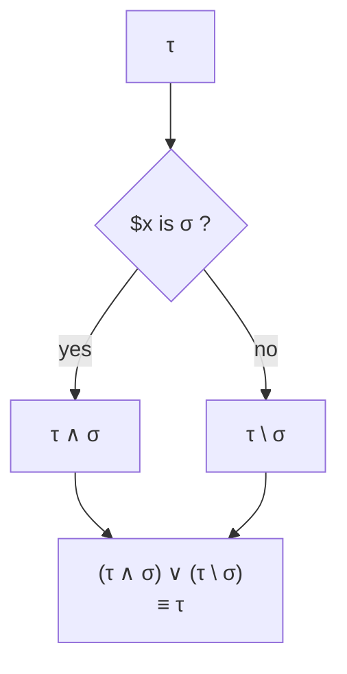

# Intersection

> The dual of combination: the greatest lower bound $\tau \land \sigma$, the type-theoretic difference $\tau \setminus \sigma$, and the *narrowing* operation that applies them in the presence of assertions.

Where combination joins types as control flow re-converges, intersection narrows them as the analyser learns. An assertion says: "in this branch, the value is *also* of type $\sigma$"; the type at that point is the intersection of its prior type with $\sigma$. A negative assertion says: "in this branch, the value is *not* of type $\sigma$"; the type at that point is the difference. These are the operations by which a static type approaches a runtime value.

This chapter describes the intersection lattice in three layers: the intersection operation itself (the greatest lower bound), the difference operation (the negation), and the narrowing operation that consumes both in response to assertions.

## 1. Specification of intersection

For any types $\tau$, $\sigma$:

$$
\tau \land \sigma \mathrel{<:} \tau \qquad \tau \land \sigma \mathrel{<:} \sigma \qquad \text{(lower bound)}
$$

$$
\forall \rho.\; (\rho \mathrel{<:} \tau \land \rho \mathrel{<:} \sigma) \implies \rho \mathrel{<:} \tau \land \sigma \qquad \text{(greatest lower bound)}
$$

The intersection of $\tau$ and $\sigma$ is the largest type whose values are both $\tau$-values and $\sigma$-values. It is unique up to equivalence.

By convention:

$$
\tau \land \bot \equiv \bot
\qquad
\tau \land \top \equiv \tau
\qquad
\tau \land \tau \equiv \tau
\qquad
\tau \land \sigma \equiv \sigma \land \tau
\qquad
(\tau \land \sigma) \land \rho \equiv \tau \land (\sigma \land \rho)
$$

Intersection is the meet of the subtyping lattice.

## 2. Computing intersections

### 2.1 Distribution over union

A type is a union of atoms. Intersection distributes over union:

$$
(\alpha \lor \beta) \land \gamma \equiv (\alpha \land \gamma) \lor (\beta \land \gamma)
$$

Computing $\tau \land \sigma$ therefore reduces to computing pairwise atom intersections, then taking the union of the non-empty results.

### 2.2 Atom-pair intersection

For atoms $\alpha$, $\beta$, the intersection is one of:

- **$\bot$**: the atoms are disjoint ($\alpha \mathrel{\#} \beta$). They share no values.
- **$\alpha$**: $\alpha \mathrel{<:} \beta$. The intersection is the more specific atom.
- **$\beta$**: $\beta \mathrel{<:} \alpha$. Symmetric.
- **A new atom**: neither subsumes the other, but they overlap, and the overlap is itself representable. This is the structurally interesting case.

The disjointness rules (when intersection is $\bot$) are catalogued in **[comparison.md](./comparison.md)** §2.1: the principal categorical axes are `bool`, `int`, `float`, `string`, `object`, `array`, `resource`, plus `null` and `void` as singletons. Intersections across these axes collapse to $\bot$.

### 2.3 Family-specific intersections

#### 2.3.1 Scalar lattice

| Pair | Intersection |
|------|--------------|
| $\text{int} \land \text{Range}(lo, hi)$ | $\text{Range}(lo, hi)$ (absorption) |
| $\text{Range}(a, b) \land \text{Range}(c, d)$ | $\text{Range}(\max(a, c), \min(b, d))$ if interval non-empty; else $\bot$ |
| $\text{Literal}(n) \land \text{Range}(lo, hi)$ | $\text{Literal}(n)$ if $n \in [lo, hi]$; else $\bot$ |
| $\text{Literal}(n) \land \text{Literal}(m)$ | $\text{Literal}(n)$ if $n = m$; else $\bot$ |
| $\text{true} \land \text{false}$ | $\bot$ |
| $\text{true} \land \text{bool}$ | $\text{true}$ |
| $\text{numeric} \land \text{string}$ | $\text{numeric-string}$ |
| $\text{array-key} \land \text{string}$ | $\text{string}$ |
| $\text{class-like-string} \land \text{string}$ | $\text{class-like-string}$ (when string allows it) |
| $\text{class-like-string} \land \text{Literal}\{value\}$ | $\text{class-like-string}$ with that value, if compatible |

For string refinements: the intersection takes the conjunction of refinement bits. $\text{non-empty-string} \land \text{truthy-string} \equiv \text{non-empty-truthy-string}$ (a string with both refinement bits set). Casing intersections: $\text{lowercase-string} \land \text{uppercase-string} \equiv \bot$ if both are required and non-empty.

#### 2.3.2 Object atoms

| Pair | Intersection |
|------|--------------|
| $\text{Named}(C) \land \text{Named}(D)$, $C \preceq D$ | $\text{Named}(C)$ |
| $\text{Named}(C) \land \text{Named}(D)$, $D \preceq C$ | $\text{Named}(D)$ |
| $\text{Named}(C) \land \text{Named}(D)$, unrelated | $\text{Named}(C, \text{intersections}=[D])$ (compositional) |
| $\text{Named}(C) \land \text{Named}(D)$, both final, unrelated | $\bot$ |
| $\text{Object::Any} \land \text{Named}(C)$ | $\text{Named}(C)$ |
| $\text{Enum}(E, c) \land \text{Enum}(E, \text{None})$ | $\text{Enum}(E, c)$ |
| $\text{Enum}(E, c_1) \land \text{Enum}(E, c_2)$ | $\text{Enum}(E, c_1)$ if $c_1 = c_2$; else $\bot$ |
| $\text{Named}(C) \land \text{Enum}(E, \text{None})$ | $\text{Named}(C)$ if $C \preceq E$ |
| $\text{HasMethod}(m) \land \text{Named}(C)$ | $\text{Named}(C)$ if $\Gamma$ confirms $C$ declares $m$; else $\text{Named}(C, \text{intersections}=[\text{HasMethod}(m)])$ |
| $\text{WithProperties}\{\dots\} \land \text{Named}(C)$ | shape narrowed by $C$'s declared property types |
| $\text{WithProperties}\{a: \tau_a\} \land \text{WithProperties}\{b: \tau_b\}$ | $\text{WithProperties}\{a: \tau_a, b: \tau_b\}$ |
| $\text{WithProperties}\{a: \tau\} \land \text{WithProperties}\{a: \sigma\}$ | $\text{WithProperties}\{a: \tau \land \sigma\}$ |

Object intersection is *compositional*: when neither side absorbs the other, the result accumulates additional constraints in the intersection list of $\text{Named}$. Two object types intersected are sound to coexist as long as no constraint is contradicted.

#### 2.3.3 Array atoms

| Pair | Intersection |
|------|--------------|
| $\text{List}(T) \land \text{List}(U)$ | $\text{List}(T \land U)$ |
| $\text{List}(T) \land \text{Keyed}(\text{parameters}=(\text{int}, U))$ | $\text{List}(T \land U)$ |
| $\text{Keyed}(\text{in}) \land \text{Keyed}(\text{out})$ | pointwise intersection on shared keys, plus union of unshared keys, with optional flags promoted by either side |
| $\text{non\_empty} \land \text{any}$ | $\text{non\_empty}$ |
| $\text{sealed}_{\text{in}} \land \text{sealed}_{\text{out}}$ | $\text{sealed}$ (with both shapes' keys; if any key type intersects to $\bot$, the whole intersection is $\bot$) |

Shape intersection is the operation that gives $\text{array}\{a: \text{int}\} \land \text{array}\{b: \text{string}\} \equiv \text{array}\{a: \text{int}, b: \text{string}\}$. When two shapes share a key, their value types intersect.

#### 2.3.4 Iterable atoms

| Pair | Intersection |
|------|--------------|
| $\text{Iterable}(K_1, V_1) \land \text{Iterable}(K_2, V_2)$ | $\text{Iterable}(K_1 \land K_2, V_1 \land V_2)$ |
| $\text{Iterable}(K, V) \land \text{Array}$ | $\text{Array}$ refined by $(K, V)$ on key/value |
| $\text{Iterable}(K, V) \land \text{Named}(C)$ | $\text{Named}(C)$ if $\Gamma$ says $C$ implements $\text{Traversable}\langle K, V\rangle$ with parameters narrowed accordingly; else $\text{Named}(C, \text{intersections}=[\text{Iterable}(\dots)])$ |

#### 2.3.5 Callable atoms

Two callable atoms intersect by intersecting their signatures pointwise: parameters take the *union* (because parameters are contravariant), return takes the intersection, and refinement flags (purity, throws) take the intersection of guarantees.

#### 2.3.6 Resource atoms

| Pair | Intersection |
|------|--------------|
| $\text{Resource}(\text{None}) \land \text{Resource}(\text{closed})$ | $\text{Resource}(\text{closed})$ |
| $\text{Resource}(\text{open}) \land \text{Resource}(\text{closed})$ | $\bot$ |

#### 2.3.7 Generic parameters

| Pair | Intersection |
|------|--------------|
| $T \land T$ (same parameter, same scope) | $T$ |
| $T \land \tau$, $\tau$ supertype of $T$'s constraint | $T$ |
| $T \land \tau$ otherwise | $T$ with intersections augmented by $\tau$ |
| $T \land U$ (distinct parameters) | accumulated intersections; the comparator does not flatten |

#### 2.3.8 Indirection and derived atoms

References are resolved before intersection is consulted. Aliases are transparent: their bodies intersect. Two derived atoms intersect by structural equality only: when the inputs are identical, the result is the same derived atom; when they differ, the intersection is $\bot$ unless one side resolves further.

## 3. The difference operation

The dual of intersection by union-distribution is *difference*: $\tau \setminus \sigma$ is the type whose values are in $\tau$ but not in $\sigma$. It is the operation invoked by *negative* assertions.

### 3.1 Specification

For any types $\tau$, $\sigma$:

$$
(\tau \setminus \sigma) \mathrel{<:} \tau \qquad \text{(values come from } \tau)
$$

$$
(\tau \setminus \sigma) \land \sigma \equiv \bot \qquad \text{(values are not in } \sigma)
$$

$$
\forall \rho.\; (\rho \mathrel{<:} \tau \land \rho \land \sigma \equiv \bot) \implies \rho \mathrel{<:} (\tau \setminus \sigma) \qquad \text{(greatest such type)}
$$

The difference is the largest type contained in $\tau$ whose intersection with $\sigma$ is empty.

### 3.2 Distribution

Difference distributes over union on the left and intersects with complement on the right:

$$
(\alpha \lor \beta) \setminus \gamma \equiv (\alpha \setminus \gamma) \lor (\beta \setminus \gamma)
$$

$$
\alpha \setminus (\beta \lor \gamma) \equiv (\alpha \setminus \beta) \setminus \gamma \equiv (\alpha \setminus \gamma) \setminus \beta
$$

Computing $\tau \setminus \sigma$ therefore reduces to computing per-atom differences.

### 3.3 Atom-pair difference

For atoms $\alpha$, $\beta$:

- If $\alpha \mathrel{<:} \beta$: $\alpha \setminus \beta \equiv \bot$. Every $\alpha$-value is a $\beta$-value.
- If $\alpha \mathrel{\#} \beta$: $\alpha \setminus \beta \equiv \alpha$. The atoms are disjoint; subtraction is identity.
- Otherwise, the difference depends on the atom family.

#### 3.3.1 Concrete differences

| Input | Result | Notes |
|-------|--------|-------|
| $\text{int} \setminus \text{Literal}(0)$ | $\text{non-zero-int}$ | |
| $\text{int} \setminus \text{Range}(lo, hi)$ | $\text{Range}(-\infty, lo-1) \lor \text{Range}(hi+1, +\infty)$ | intersected with int's full range |
| $\text{string} \setminus \text{Literal}(\text{""})$ | $\text{non-empty-string}$ | |
| $\text{non-empty-string} \setminus \text{Literal}(\text{""})$ | $\text{non-empty-string}$ | already excluded |
| $\text{bool} \setminus \text{true}$ | $\text{false}$ | |
| $\text{bool} \setminus \text{false}$ | $\text{true}$ | |
| $\text{mixed} \setminus \text{null}$ | $\text{mixed}(\text{non\_null})$ | |
| $\text{mixed} \setminus \text{false}$ | $\text{mixed}(\text{truthy})$ | modulo other falsy values |
| $\text{mixed}(\text{truthy}) \setminus \text{true}$ | $\text{mixed}(\text{truthy})$ | still truthy |
| $\text{Range}(a, b) \setminus \text{Range}(c, d)$ | one or two output ranges | the part of $[a, b]$ not in $[c, d]$ |
| $\text{List}(T) \setminus \text{Empty}$ | $\text{non-empty-list}\langle T\rangle$ | |
| $\text{Keyed}\{a: \tau \lor \text{null}\} \setminus \text{Keyed}\{a: \text{null}\}$ | $\text{Keyed}\{a: \tau\}$ | |
| $\text{Named}(C) \setminus \text{Named}(D)$, $D \preceq C$ | $\text{Named}(C)$ | conservative, open world |

The general rule is: difference computes precisely when one of the atoms is a closed enumeration (`bool`, sealed enums, finite literal sets, sealed shapes) and conservatively otherwise. For open-world types like $\text{Named}(C) \setminus \text{Named}(D)$ where $D$ is a subclass of $C$, the type system cannot rule out the existence of a third subclass that extends $C$ but not $D$, so the difference returns $\text{Named}(C)$ unchanged.

#### 3.3.2 Difference is partial

When the difference cannot be precisely represented, it conservatively returns the input. This is sound: the resulting type is a true superset of the precise difference, and any subsequent operation that needs more precision will produce its own conservative result.

## 4. Narrowing

*Narrowing* is the operation that combines intersection and difference in response to *assertions*. An assertion is a fact the analyser learns about a value at a particular program point; narrowing applies that fact to the value's type.

### 4.1 Specification

Given a value of type $\tau$ and an assertion that the value is "of type" $\sigma$, the narrowed type is $\tau \land \sigma$.

Given a value of type $\tau$ and an assertion that the value is "not of type" $\sigma$, the narrowed type is $\tau \setminus \sigma$.

When the assertion is not directly a type but a predicate (e.g. "this value is non-empty", "this value satisfies `is_int`"), the predicate is first translated into a type, then narrowing applies.

### 4.2 Compound assertions

An assertion may compose multiple positive and negative facts. Compound assertions translate into the corresponding compound operations:

| Assertion | Narrowed type |
|-----------|---------------|
| of type $\sigma$ AND of type $\rho$ | $\tau \land \sigma \land \rho$ |
| of type $\sigma$ OR of type $\rho$ | $(\tau \land \sigma) \lor (\tau \land \rho)$ |
| not of type $\sigma$ AND not of type $\rho$ | $(\tau \setminus \sigma) \setminus \rho$ |
| not of type $\sigma$ OR not of type $\rho$ | $\tau \setminus (\sigma \land \rho)$ |

### 4.3 Predicate assertions

Common assertions express *predicates* that translate into types before narrowing:

| Assertion | Type translation |
|-----------|------------------|
| `is_int($x)` | $\text{int}$ |
| `is_string($x)` | $\text{string}$ |
| `is_array($x)` | $\text{array}\langle\text{array-key}, \text{mixed}\rangle$ |
| `is_object($x)` | $\text{object}$ |
| `is_null($x)` | $\text{null}$ |
| `is_callable($x)` | $\text{callable}$ |
| `$x === null` | $\text{null}$ |
| `$x === true` | $\text{true}$ |
| `$x === ""` | $\text{Literal}(\text{""})$ |
| `count($x) > 0` | $\text{non-empty-array}\langle\dots\rangle$ |
| `$x instanceof C` | $\text{Named}(C)$ |
| `array_key_exists('a', $x)` | $\text{array}\{a: \dots\}$ shape with $a$ required |
| empty / falsy check | $\text{mixed}(\text{falsy}) \lor \bot$ of type-specific falsy values |

The negation of each of these translates directly into a difference. The set of supported predicates is open: the type system only specifies the operations of intersection and difference; the analyser supplies the translation from program-level predicates to types.

### 4.4 Narrowing of unions

When the value's type is a union $\alpha_1 \lor \dots \lor \alpha_n$, narrowing distributes:

$$
(\alpha_1 \lor \dots \lor \alpha_n) \land \sigma \equiv (\alpha_1 \land \sigma) \lor \dots \lor (\alpha_n \land \sigma) \quad \text{(drop } \bot \text{ atoms)}
$$

$$
(\alpha_1 \lor \dots \lor \alpha_n) \setminus \sigma \equiv (\alpha_1 \setminus \sigma) \lor \dots \lor (\alpha_n \setminus \sigma) \quad \text{(drop } \bot \text{ atoms)}
$$

A particular atom that intersects with the assertion to $\bot$ is *eliminated* from the union; an atom that intersects to itself is *preserved unchanged*; an atom that intersects to a strict subtype is *refined* in place.

This is what makes a sequence of assertions usefully narrow a union: each assertion eliminates some atoms, refines others. After several assertions, the residual type is precisely what the program has proven the value to be.

### 4.5 Idempotent narrowing

Narrowing is idempotent: applying the same assertion twice produces the same result as applying it once.

$$
(\tau \land \sigma) \land \sigma \equiv \tau \land \sigma
\qquad
(\tau \setminus \sigma) \setminus \sigma \equiv \tau \setminus \sigma
$$

This is a property of the underlying lattice operations.

### 4.6 Narrowing across control flow

When narrowing is invoked at a branch point, the narrowed type lives only within that branch. When control flow rejoins, combination (**[combination.md](./combination.md)**) takes over: the rejoined type is the union of the per-branch narrowings.

The equivalence on the rejoin holds *up to coarsening* on the difference side: if the difference is conservative (returns the input unchanged because it cannot be precisely computed), the recombined type is $(\tau \land \sigma) \lor \tau$, which simplifies back to $\tau$. Either way, no information is lost; only narrower precision in branches that the union does not preserve.

## 5. Properties of intersection and difference

For any types $\tau$, $\sigma$, $\rho$:

- **Idempotence**: $\tau \land \tau \equiv \tau$.
- **Commutativity**: $\tau \land \sigma \equiv \sigma \land \tau$.
- **Associativity**: $(\tau \land \sigma) \land \rho \equiv \tau \land (\sigma \land \rho)$.
- **Identity**: $\tau \land \top \equiv \tau$.
- **Annihilation**: $\tau \land \bot \equiv \bot$.
- **Monotonicity**: if $\tau \mathrel{<:} \tau'$ and $\sigma \mathrel{<:} \sigma'$, then $\tau \land \sigma \mathrel{<:} \tau' \land \sigma'$.
- **Distribution over union**: $\tau \land (\sigma \lor \rho) \equiv (\tau \land \sigma) \lor (\tau \land \rho)$.
- **De Morgan-style relation**: $\tau \setminus (\sigma \lor \rho) \equiv (\tau \setminus \sigma) \setminus \rho$.
- **Self-difference**: $\tau \setminus \tau \equiv \bot$.
- **Empty-difference**: $\tau \setminus \bot \equiv \tau$.
- **Total-difference**: $\tau \setminus \top \equiv \bot$.

Together with combination, intersection forms the *lattice* on types: combination is the join, intersection is the meet, with $\bot$ as the bottom and $\top$ as the top. Difference is not a lattice operation per se but is the operation by which the lattice supports negative reasoning.

## 6. Worked examples

| Input | Result |
|-------|--------|
| $\text{int} \land \text{string}$ | $\bot$ |
| $\text{int} \land \text{Range}(0, 10)$ | $\text{Range}(0, 10)$ |
| $\text{non-empty-string} \land \text{lowercase-string}$ | $\text{non-empty-lowercase-string}$ |
| $\text{class-like-string} \land \text{non-empty-string}$ | $\text{class-like-string}$ |
| $\text{array}\{a: \text{int} \lor \text{null}\} \land \text{array}\{a: \text{int}\}$ | $\text{array}\{a: \text{int}\}$ |
| $\text{array}\{a: \text{int}\} \land \text{array}\{b: \text{string}\}$ | $\text{array}\{a: \text{int}, b: \text{string}\}$ |
| $\text{Named}(\text{Iterator}) \land \text{Named}(\text{Countable})$ | $\text{Named}(\text{Iterator}, \text{intersections}=[\text{Countable}])$ |
| $\text{true} \land \text{false}$ | $\bot$ |
| $\text{mixed} \setminus \text{null}$ | $\text{mixed}(\text{non\_null})$ |
| $\text{int} \lor \text{null} \setminus \text{null}$ | $\text{int}$ |
| $\text{list}\langle\text{int} \lor \text{string}\rangle \setminus \text{list}\langle\text{int}\rangle$ | $\text{list}\langle\text{int} \lor \text{string}\rangle$ (conservative) |
| $\text{bool} \setminus \text{true}$ | $\text{false}$ |
| $\text{Range}(0, 10) \setminus \text{Range}(3, 7)$ | $\text{Range}(0, 2) \lor \text{Range}(8, 10)$ |

## 7. What intersection does not do

- It does not *evaluate* derived atoms. Two $\text{KeyOf}$ atoms intersect by structural equality on their inputs, not by computing the keys and intersecting the results. Evaluation belongs to the resolver.
- It does not introduce *new* atoms outside the algebra of §2.3 and §3.3. When two atoms are categorically disjoint, the intersection is $\bot$; when they overlap structurally, the intersection is the structural overlap; when neither, the result is conservative.
- It does not perform *closed-world reasoning* on open-world hierarchies. Subtracting $\text{Named}(D)$ from $\text{Named}(C)$ (where $D \preceq C$) does not produce $\text{Named}(C) \setminus \text{Named}(D)$; it returns $\text{Named}(C)$ because the analyser cannot rule out other subclasses.
- It does not compute *flow*. Narrowing is the operation invoked by an analyser at a particular program point; the analyser is responsible for tracking which assertion holds where. The type system supplies the operation; the flow is supplied externally.

Combination is the additive part of the type system; intersection and difference are the subtractive part. Together they describe the full lattice of types under PHP's value space.
