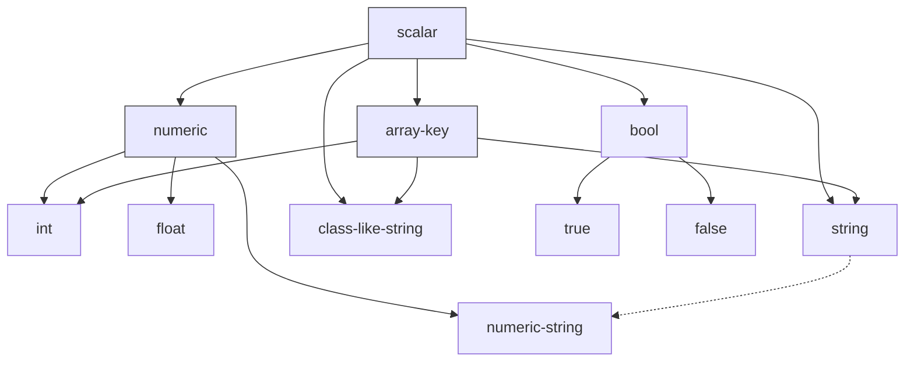
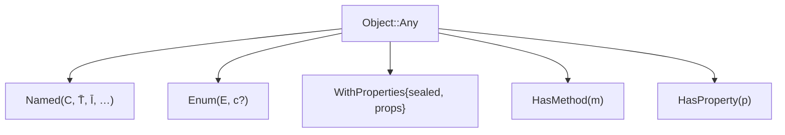
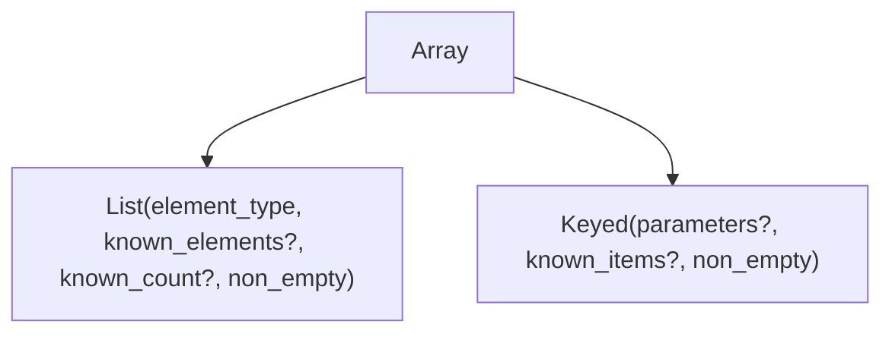
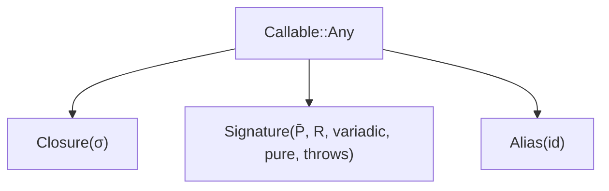

# Types

> The vocabulary. Every atom, every refinement axis, what each type denotes.

A *type* is a finite union of *atoms*. The empty union is $\bot$ (`never`). Each atom denotes a set of run-time PHP values, possibly refined by additional constraints. The atoms below cover every PHP value an analyser must reason about: the universal types, the scalar lattice, objects in their many flavours, arrays in two structural shapes, iterables, callables, resources, the indirection atoms that name things in the program environment, and the type-level functions that compute over types.

## 1. Universal atoms

- **`never`**: the empty type. Inhabits no value. Equivalent to $\bot$.
- **`null`**: the singleton set $\{\mathrm{NULL}\}$.
- **`void`**: a function-return-only sentinel. Treated as $\bot$ for value-flow purposes, but distinguished from `null` for return-position checking: a function declared to return `void` may not return any value.
- **`mixed(c)`**: the universal type, optionally narrowed by a constraint $c$ over four orthogonal axes:
  - $\mathit{non\_null}$: admits all values except `null`.
  - $\mathit{truthy}$ / $\mathit{falsy}$: admits only values that coerce to `true` / `false` in boolean context.
  - $\mathit{empty}$: admits values for which `empty($v)` returns true.
  - $\mathit{isset\_from\_loop}$: provenance, this `mixed` came from `isset` narrowing inside a loop, so the analyser should not assume the property exists on later iterations.
  - Vanilla `mixed` is the unconstrained form and corresponds to $\top$.
- **`placeholder`**: the wildcard. Equivalent to `mixed` for substitution purposes; appears only at intermediate stages of analysis where the resolver has not yet filled it in.

## 2. Scalar atoms

PHP's scalar lattice is shaped by three supertypes (`scalar`, `numeric`, `array-key`), four base leaves (`bool`, `int`, `float`, `string`), and a fifth specialised string family (`class-like-string`).



### 2.1 Lattice supertypes

- **`scalar`**: the join of all primitive scalar atoms.
- **`numeric`**: the join of $\text{int} \lor \text{float} \lor \text{numeric-string}$.
- **`array-key`**: the join of $\text{int} \lor \text{string} \lor \text{class-like-string}$. Class-like-strings are array-keys because at runtime they are strings.

### 2.2 Bool

- **`bool`**, **`true`**, **`false`**.
- $\text{true} \lor \text{false} \equiv \text{bool}$. $\text{true} \mathrel{\#} \text{false}$.

### 2.3 Integer

The integer atom carries one of:

- **`Unspecified`**: any integer.
- **`UnspecifiedLiteral`**: provenance, came from a literal, value erased.
- **`Literal(n)`** for $n \in \mathbb{Z}$.
- **`Range(lo, hi)`** with $lo, hi \in \mathbb{Z} \cup \{-\infty, +\infty\}$.

Range subsumes the named refinements:

- $\text{positive-int} \equiv \text{Range}(1, +\infty)$
- $\text{negative-int} \equiv \text{Range}(-\infty, -1)$
- $\text{non-negative-int} \equiv \text{Range}(0, +\infty)$
- $\text{non-positive-int} \equiv \text{Range}(-\infty, 0)$
- $\text{non-zero-int} \equiv \text{Range}(-\infty, -1) \lor \text{Range}(1, +\infty)$

### 2.4 Float

- **`Unspecified`**, **`UnspecifiedLiteral`**, **`Literal(x)`** for $x \in \mathbb{R}$.

### 2.5 String

A string atom is the product of five orthogonal refinement axes:

- **`literal`**: `None`, `UnspecifiedLiteral` (origin known, value erased), or `Value(s)` (a known literal value).
- **`casing`**: `Unspecified`, `Lowercase`, or `Uppercase`.
- **`is_numeric`**: the value passes PHP's `is_numeric`.
- **`is_truthy`**: the value is non-empty and not `"0"`.
- **`is_non_empty`**: the value has length $\geq 1$.
- **`is_callable`**: the value names a callable.

These axes combine multiplicatively. The unrefined `string` has every refinement bit cleared and `literal = None`. Named refinements (`non-empty-string`, `numeric-string`, `truthy-lowercase-string`, etc.) are points in this space.

### 2.6 Class-like-string

A specialised string atom for strings naming classes, interfaces, enums, or traits.

- **`kind`** $\in \{\text{Class}, \text{Interface}, \text{Enum}, \text{Trait}\}$. Kinds are pairwise disjoint.
- Refinement variants:
  - **`Any{kind}`**: any string naming a thing of that kind.
  - **`OfType{kind, τ}`**: any class-like-string whose value names something $\mathrel{<:} \tau$.
  - **`Generic{kind, τ}`**: a class-like-string whose constraint depends on a template parameter; resolved when the parameter is bound.
  - **`Literal{value}`**: a known specific class-like-name.

$\text{class-like-string} \mathrel{<:} \text{string}$ (when the container `string` has no refinement requirement that the class-like-string violates), and $\text{class-like-string} \mathrel{<:} \text{array-key}$.

## 3. Object atoms



- **`Object::Any`**: any object value. The top of the object family.
- **`Named(C, T̄, Ī, …)`**: an instance of a named class, interface, or trait $C$, with:
  - optional list of type-parameter arguments $\bar{T}$ (when $C$ is parametric),
  - optional list of intersection atoms $\bar{I}$ (the trailing `& B & C` in `A & B & C`),
  - modality flags `is_static` (distinguishes `static` from a fixed class name) and `is_this` (distinguishes `$this`).
- **`Enum(E, c?)`**: an enum value. $c = \text{None}$ is "any case of $E$"; $c = \text{Some}(\textit{case})$ is a specific case literal.
- **`WithProperties{sealed, props}`**: an object with a known shape, the structural counterpart of `array{…}`. Each property carries an *optional* flag (whether the property may be absent at runtime). When `sealed`, no additional properties are admitted.
- **`HasMethod(m)`**: an object known to have method $m$. Produced by `method_exists` narrowing.
- **`HasProperty(p)`**: an object known to have property $p$. Produced by `property_exists` narrowing.

## 4. Array atoms

PHP arrays are syntactically uniform but the type system distinguishes two structural shapes.



### 4.1 List

- **`List(element_type, known_elements?, known_count?, non_empty)`**: an array used as a sequence, with zero-based integer keys.
  - `element_type` is the element type (the $T$ in `list<T>`).
  - `known_elements` is an optional map from index to (`optional_flag`, `element_type`) for typed sequences such as `list{0: int, 1: string, …}`.
  - `known_count` is set when the count is fully known.
  - `non_empty` distinguishes `non-empty-list<T>`.

### 4.2 Keyed

- **`Keyed(parameters?, known_items?, non_empty)`**: an array used as a record.
  - `parameters` (when present) is `(key_type, value_type)` and represents the "rest" of the array; `parameters = None` means the array is *sealed*.
  - `known_items` is an optional map from a specific key (integer or string) to (`optional_flag`, `value_type`), used for `array{a: int, b?: string}`-style shapes.
  - `non_empty` distinguishes `non-empty-array<K, V>`.

A list is conceptually a keyed array with `parameters = (int, T)` and `known_items = None`; the structural integer-key constraint is preserved as a separate atom because comparators dispatch on it directly.

## 5. Iterable atoms

- **`Iterable(K, V, Ī?)`**: an iterable producing keys of type $K$ and values of type $V$. The optional intersection list $\bar{I}$ allows shapes such as `iterable<K, V> & Countable`.

$\text{iterable}\langle K, V\rangle$ is conceptually $\text{array}\langle K, V\rangle \lor \text{Traversable}\langle K, V\rangle$; it is its own atom because narrowing on either branch produces different precise types.

## 6. Callable atoms



- **`Callable::Any`**: any callable.
- **`Closure(σ)`**: an instance of `\Closure` with signature $\sigma$. A `Closure` is also an object: $\text{Closure} \mathrel{<:} \text{Named}(\backslash\text{Closure})$.
- **`Signature(P̄, R, variadic, pure, throws)`**: an explicit callable signature. Each parameter carries: type, name, default-value flag, by-reference flag, variadic flag.
- **`Alias(id)`**: a reference to a known callable by identifier:
  - $\mathrm{Function}(\textit{name})$: a free function, identified by name.
  - $\mathrm{Method}(\textit{class}, \textit{method})$: a method on a class, identified by class name and method name.
  - $\mathrm{Closure}(\textit{span})$: a specific closure expression, identified by source position (closures have no name).

Several non-callable atoms are *callable-shaped* and thus inhabit `Callable::Any`: a literal class-string with a `::` separator, a callable-string, an object with `__invoke`, and a 2-tuple array `[class-or-instance, method]`.

## 7. Resource atoms

- **`Resource(closed?)`**: a resource value.
  - `closed = None` is the unconstrained `resource`.
  - `closed = Some(false)` is `open-resource`.
  - `closed = Some(true)` is `closed-resource`.

## 8. Indirection atoms (resolved against $\Gamma$)

These atoms denote things parsed but not yet bound to their meaning in the program environment. They are *resolved* (replaced by their target) before subtyping is consulted.

- **`Reference{name, params?, intersections?}`**: a name encountered in type position. Resolves to a class-like (`Named`), an alias body, or a constant value type.
- **`Member{class, selector}`**: a class-constant reference. The selector is one of `Identifier(name)`, `StartsWith(prefix)`, `EndsWith(suffix)`, `Contains(infix)`, `Wildcard`. Wildcard selectors resolve to the union of all matching constants' types.
- **`Global{selector}`**: analogously for global constants.
- **`Alias{class, alias_name}`**: a reference to a named type alias defined on a class. By default *transparent* under subtyping (resolves to the alias body); *opaque* only for display.

## 9. Generic and template atoms

- **`GenericParameter{name, scope, constraint, intersections?}`**: a template parameter that is in scope. Stands for some unknown type bounded by `constraint`, with the additional property that all occurrences of the same parameter in the same scope refer to the same value-type.
- **`Variable(name)`**: a binding-scope variable used during template inference. Replaced by a concrete type when inference completes; does not survive into stored types.

## 10. Conditional atoms

- **`Conditional{subject, target, then, otherwise, negated}`**: `subject is target ? then : otherwise` (or its negated form). Frozen while `subject` contains free template parameters; resolved by branch selection when `subject` is concrete.

## 11. Type-level functions (derived atoms)

Each derived atom is a deferred computation over other types, evaluated against $\Gamma$:

- **`KeyOf(τ)`**: the key type of $\tau$ if $\tau$ is array-like or iterable. $\text{array}\langle K, V\rangle \to K$. $\text{list}\langle T\rangle \to \text{int}$. $\text{array}\{a, b\} \to \text{'a'} \lor \text{'b'}$.
- **`ValueOf(τ)`**: the value type. For backed enums, the union of backing-value types.
- **`PropertiesOf(τ, vis?)`**: $\text{array}\{\text{prop\_name}: \text{prop\_type}, \dots\}$, optionally filtered by visibility. For non-final classes, the result is unsealed (subclasses may add properties).
- **`IndexAccess(τ, k)`**: element access at the type level. $\tau[k]$.
- **`IntMask(values)`**: the set of integers obtainable by bitwise-OR-ing subsets of the constituent literal-int values.
- **`IntMaskOf(τ)`**: `IntMask` over a wildcard family of integer constants.
- **`TemplateType(o, c, t)`**: given an object value $o$, a class name $c$ in $o$'s ancestry, and a template name $t$, the type bound to $t$ in $o$-as-$c$.
- **`New(τ)`**: when $\tau$ is class-string-shaped, the corresponding instance type.

While unresolved, derived atoms are themselves; they participate in subtyping by structural equality. Once their inputs are concrete, they evaluate to a regular type.

## 12. Canonical form

A type is in *canonical form* when:

1. Atoms appear in a fixed total order.
2. No atom is duplicated.
3. No atom is subsumed: $\alpha \lor \beta \equiv \beta$ whenever $\alpha \mathrel{<:} \beta$ is dropped to $\beta$.
4. Family-specific absorptions (range merging, literal generalisation past thresholds, $\text{true} \lor \text{false} \equiv \text{bool}$) have been applied.

Equivalence on canonical forms reduces to multi-set equality on atoms. Two atoms are *structurally equal* iff their variant tags coincide and all carried fields are pointwise equal, recursively, with nested types compared on their canonical form.

The full apparatus for building canonical forms is in **[combination.md](./combination.md)**.

## 13. Worked example

The type

```
object|string|positive-int|3.5|array{
    a: non-empty-string,
    b: truthy-string,
    c: int<-100, 2>,
    d: float|2|"hello, world",
    ...<string, bool>
}|list<true|int>|object{a: T}
```

decomposes into these atoms:

1. $\text{Object::Any}$.
2. $\text{String}\{\text{literal}=\text{None}, \text{casing}=\text{Unspecified}, \text{all-refinement-bits}=\text{false}\}$.
3. $\text{Int}(\text{Range}(1, +\infty))$.
4. $\text{Float}(\text{Literal}(3.5))$.
5. A keyed array, $\text{non\_empty}=\text{true}$, $\text{parameters}=\text{Some}((\text{string}, \text{bool}))$, with known items: $a \to (\text{required}, \text{non-empty-string})$, $b \to (\text{required}, \text{truthy-string})$, $c \to (\text{required}, \text{int}\langle -100, 2\rangle)$, $d \to (\text{required}, \text{float} \lor \text{Literal}(2) \lor \text{Literal}(\text{"hello, world"}))$.
6. A list with element type $\text{bool}(\text{true}) \lor \text{int}$.
7. An object shape, sealed, with property $a$ of type $\text{GenericParameter}(T)$.

The seven atoms are pairwise non-comparable: $\text{Object::Any}$ does not contain a sealed shape and a sealed shape does not contain $\text{Object::Any}$; atom 7 cannot reduce further until $T$ is bound. Their union admits any object, any string, any positive integer, the float `3.5`, any non-empty array of the described shape, any list of `true` or integer values, and any sealed `object{a: T}` for whatever $T$ resolves to.
